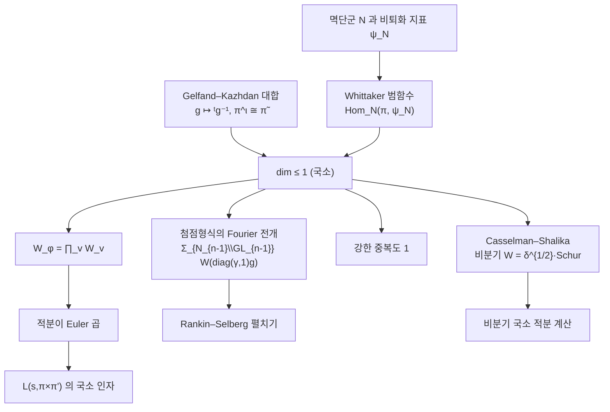

# Whittaker 모형과 중복도 1

# 개요

[Rankin–Selberg 적분](rankin-selberg.md)이 Euler 곱으로 쪼개지려면 전역 적분의 피적분함수가 자리마다의 곱으로 분해되어야 하고, 그 분해를 보장하는 것이 **Whittaker 모형의 유일성**이다.

$\mathrm{GL}_n$ 의 상삼각 멱단군 $N$ 과 그 위의 비퇴화 지표 $\psi_N$ 에 대해, 표현 $\pi$ 의 Whittaker 모형은 $\pi$ 를 다음 성질을 갖는 함수공간으로 실현한 것이다.

$$
W\negthinspace\left(\begin{pmatrix}1&*\cr&\ddots\cr&&1\end{pmatrix}g\right)=\psi_N(n)\thinspace W(g)
$$

이 실현은 Fourier 계수를 대신한다. $\mathrm{GL}_2$ 에서 첨점형식의 Fourier 전개 $\sum a_nq^n$ 은 $N\cong\mathbb G_a$ 가 아벨군이라 수열로 적히지만, $n\ge3$ 에서 $N$ 은 아벨군이 아니어서 계수 자리에 수 대신 함수가 오고 그 함수가 Whittaker 함수다.

정리는 이 실현이 많아야 하나라고 말한다.

$$
\dim\mathrm{Hom}_{N(F)}\bigl(\pi,\psi_N\bigr)\le1
$$

국소적으로는 Gelfand–Kazhdan 과 Shalika 가 증명했고 전역 진술은 국소 사실에서 따라 나온다. 유일하므로 전역 Whittaker 함수가 국소 Whittaker 함수들의 곱이 되고, 적분이 Euler 곱이 된다.

$$
W_\varphi(g)=\prod_vW_v(g_v)
$$

$\mathrm{GL}_n$ 의 자기동형 $L$ 함수 이론이 완결적이고 다른 군에서 어려운 차이가 이 유일성에 있다.

# 직관

## Fourier 전개의 일반화

$\mathrm{GL}_2$ 의 첨점형식을 아델 위의 함수 $\varphi$ 로 보면, $N\cong\mathbb G_a$ 이므로 $N(\mathbb Q)\backslash N(\mathbb A)$ 가 콤팩트 아벨군이라 지표로 전개할 수 있다.

$$
\varphi(g)=\sum_{\alpha\in\mathbb Q^\times}W_\varphi\negthinspace\left(\begin{pmatrix}\alpha&\cr&1\end{pmatrix}g\right)
$$

$W_\varphi$ 가 $\psi$ 성분이다. 첨점 조건이 $\alpha=0$ 항을 없애고, 나머지 항이 $\mathrm{GL}_1(\mathbb Q)$ 의 작용으로 한 항에서 나온다. 첨점형식이 Whittaker 함수 하나로 복원된다.

$n\ge3$ 이면 $N$ 이 비가환이라 지표만으로 전개가 끝나지 않고 다음 전개를 쓴다.

$$
\varphi(g)=\sum_{\gamma\in N_{n-1}(\mathbb Q)\backslash\mathrm{GL}_{n-1}(\mathbb Q)}
W_\varphi\negthinspace\left(\begin{pmatrix}\gamma&\cr&1\end{pmatrix}g\right)
$$

$\mathrm{GL}_1$ 자리에 $\mathrm{GL}\_{n-1}$ 이 오고, 이 합이 Rankin–Selberg 펼치기의 재료다.

## 유일성의 출처

증명은 **Gelfand–Kazhdan 의 대합**에서 나온다. $g\mapsto{}^tg^{-1}$ 는 $\mathrm{GL}_n$ 의 자기동형이고 $\pi\mapsto\tilde\pi$ 를 준다. $\mathrm{GL}_n$ 에서는 모든 기약 표현이 반대표현과 같은 지표를 갖는다.

$$
\pi^\iota\cong\tilde\pi
$$

이 대칭이 Whittaker 범함수의 공간 위에 작용해 차원을 1 이하로 묶는다. [Satake 동형](satake-isomorphism.md)의 가환성을 전치라는 반자기동형 하나로 증명하는 것과 같은 요령이다. 기하적으로는 $N\backslash G/N$ 의 궤도 문제이고, Bruhat 분해로 보면 지표 $\psi_N$ 이 살아남는 궤도가 하나뿐이다.

## 분해와 Euler 곱

전역 표현이 $\pi=\otimes'_v\pi_v$ 이므로 전역 Whittaker 범함수는 국소 범함수들의 곱을 준다. 반대 방향에 유일성이 쓰인다. 국소 공간이 1 차원이면 전역 범함수는 국소 범함수들의 곱에 스칼라를 곱한 것뿐이다. 국소 공간이 2 차원이면 전역 범함수가 여러 조합으로 쪼개져 자리마다의 적분의 곱이라는 형태가 성립하지 않는다.

$$
\text{국소 유일성}\thickspace\Longrightarrow\thickspace\text{전역 Whittaker 함수의 분해}\thickspace\Longrightarrow\thickspace\text{적분이 Euler 곱}
$$

## 유일성의 예외

- **Whittaker 모형이 없는 첨점 표현.** $\mathrm{Sp}_4$ 같은 군에는 비일반 첨점 표현이 있고 Saito–Kurokawa 올림이 그 예다.
- **유일성의 실패.** 덮개군(metaplectic group)에서는 Whittaker 모형의 차원이 1 을 넘어 $L$ 함수 이론이 미묘해진다.

대안으로 Bessel 모형, Fourier–Jacobi 모형, Shalika 모형이 쓰이고 각 모형의 유일성이 그에 맞는 적분 표현을 낳는다.



# 정의

## 비퇴화 지표

$F$ 를 국소체 또는 아델환, $\psi$ 를 자명하지 않은 가법 지표라 하자. $N_n\subset\mathrm{GL}_n$ 을 대각성분이 1 인 상삼각행렬들의 군이라 하고 다음으로 둔다.

$$
\psi_N(u)=\psi\bigl(u_{12}+u_{23}+\cdots+u_{n-1,n}\bigr)
$$

이웃한 단순근 자리의 성분만 보며, 모든 단순근 성분이 살아 있으므로 **비퇴화**다.

## Whittaker 모형

$(\pi,V)$ 를 $\mathrm{GL}_n(F)$ 의 기약 허용 표현이라 하자. **Whittaker 범함수**는 다음을 만족하는 선형사상 $\lambda:V\to\mathbb C$ 다.

$$
\lambda(\pi(u)v)=\psi_N(u)\thinspace\lambda(v),\qquad u\in N_n(F)
$$

$\lambda\ne0$ 이 있으면 $\pi$ 를 **일반적**(generic)이라 하고, 함수들 $W_v(g)=\lambda(\pi(g)v)$ 가 이루는 공간 $\mathcal W(\pi,\psi)$ 가 **Whittaker 모형**이다. 이 공간은 $W(ug)=\psi_N(u)W(g)$ 를 만족하는 함수들로 이루어지고 $\pi$ 와 동형이다.

전역적으로 첨점형식 $\varphi$ 의 Whittaker 함수는 다음이다.

$$
W_\varphi(g)=\int_{N_n(\mathbb Q)\backslash N_n(\mathbb A)}\varphi(ug)\thinspace\psi_N^{-1}(u)\thinspace du
$$

# 성질

**정리 (Gelfand–Kazhdan, Shalika).** $\mathrm{GL}\_n(F)$ 의 기약 허용 표현 $\pi$ 에 대해 $\dim\mathrm{Hom}_{N_n(F)}(\pi,\psi_N)\le1$ 이다. 첨점 자기동형 표현은 모두 일반적이고, 전역 Whittaker 함수는 국소 Whittaker 함수의 곱으로 분해된다.[^1]

## 유한군 판본

$p$ 진체 대신 유한체를 놓으면 같은 현상이 유한 계산이 된다. $G=\mathrm{GL}_n(\mathbb F_q)$ , $N$ 을 상삼각 멱단군, $\psi_N$ 을 위와 같은 지표라 할 때 유도표현

$$
\Gamma=\mathrm{Ind}_N^G\psi_N
$$

이 **Gelfand–Graev 표현**이다. Frobenius 상호법칙 $\dim\mathrm{Hom}_G(\Gamma,\pi)=\dim\mathrm{Hom}_N(\pi,\psi_N)$ 에 의해, Whittaker 모형의 유일성은 $\Gamma$ 가 중복도 없이 분해된다는 진술과 같다. 중복도 $m_i$ 에 대해 $\langle\Gamma,\Gamma\rangle=\sum m_i^2$ 이므로 이 값이 성분의 개수와 같을 때 모든 $m_i$ 가 1 이다.

```python
import itertools, cmath

def det(M, q):
    n = len(M); A = [list(r) for r in M]; d = 1
    for i in range(n):
        p = next((r for r in range(i, n) if A[r][i] % q), None)
        if p is None: return 0
        if p != i: A[i], A[p] = A[p], A[i]; d = -d
        d = d * A[i][i] % q
        iv = pow(A[i][i], q-2, q)
        for r in range(i+1, n):
            f = A[r][i]*iv % q
            for c in range(i, n): A[r][c] = (A[r][c] - f*A[i][c]) % q
    return d % q

def mul(A, B, q):
    n = len(A)
    return tuple(tuple(sum(A[i][k]*B[k][j] for k in range(n)) % q
                       for j in range(n)) for i in range(n))

def inv(M, q):
    n = len(M)
    A = [list(r) + [1 if i == j else 0 for j in range(n)] for i, r in enumerate(M)]
    for i in range(n):
        p = next(r for r in range(i, n) if A[r][i] % q)
        A[i], A[p] = A[p], A[i]
        iv = pow(A[i][i], q-2, q)
        A[i] = [x*iv % q for x in A[i]]
        for r in range(n):
            if r != i and A[r][i]:
                f = A[r][i]
                A[r] = [(A[r][c] - f*A[i][c]) % q for c in range(2*n)]
    return tuple(tuple(row[n:]) for row in A)

def gelfand_graev(n, q):
    G = [M for M in (tuple(tuple(e[i*n:(i+1)*n]) for i in range(n))
                     for e in itertools.product(range(q), repeat=n*n)) if det(M, q)]
    N = [M for M in G if all(M[i][i] == 1 for i in range(n))
                      and all(M[i][j] == 0 for i in range(n) for j in range(i))]
    Nset = set(N)
    psi = lambda M: cmath.exp(2j*cmath.pi*sum(M[i][i+1] for i in range(n-1))/q)
    chi = {}                                     # Ind_N^G ψ 의 지표
    for g in G:
        t = 0
        for x in G:
            y = mul(mul(inv(x, q), g, q), x, q)
            if y in Nset: t += psi(y)
        chi[g] = t/len(N)
    return len(G), sum(abs(chi[g])**2 for g in G).real/len(G)
```

$\mathrm{GL}_2(\mathbb F_q)$ 의 기약표현은 1 차원 $q-1$ 개, Steinberg 꼬임 $q-1$ 개, 주계열 $(q-1)(q-2)/2$ 개, 첨점 $q(q-1)/2$ 개다. $\Gamma$ 는 1 차원을 제외한 전부를 한 번씩 담으므로 성분 개수가 다음이고 $\langle\Gamma,\Gamma\rangle$ 와 같다.

$$
(q-1)+\frac{(q-1)(q-2)}2+\frac{q(q-1)}2=q(q-1)
$$

$\mathrm{GL}_3(\mathbb F_2)$ 는 기약표현이 차원 $1,3,3,6,7,8$ 의 6 개이고 $\Gamma$ 의 차원이 $21$ 이며, 일반적인 4 개 성분의 차원 합 $3+3+7+8$ 이 $21$ 이다. 자명표현과 6 차원 표현만 일반적이지 않다.

## Casselman–Shalika 공식

비분기 자리에서 Whittaker 함수의 값은 명시적이다. $\pi$ 가 비분기이고 $W^\circ$ 가 정규화한 $K$ 불변 Whittaker 함수이면

$$
W^\circ\bigl(\varpi^\lambda\bigr)=\delta_B^{1/2}(\varpi^\lambda)\thickspace s_\lambda(\alpha_1,\dots,\alpha_n)
$$

이고 $s_\lambda$ 는 **Schur 다항식**, $(\alpha_i)$ 는 [Satake 매개변수](satake-isomorphism.md)다. $\lambda$ 가 지배적이 아니면 0 이다.

Whittaker 함수의 값이 쌍대군의 기약지표이므로 Rankin–Selberg 국소 적분이 계산된다. 두 Whittaker 함수의 곱을 적분하면 Schur 다항식의 Cauchy 항등식

$$
\sum_\lambda s_\lambda(x)\thinspace s_\lambda(y)=\prod_{i,j}\frac1{1-x_iy_j}
$$

이 나오고 오른쪽이 $L(s,\pi\times\pi')$ 의 비분기 인자다.

## 강한 중복도 1

Whittaker 함수가 첨점형식을 복원하므로 두 첨점형식의 Whittaker 함수가 같으면 형식이 같다. 여기에 유일성을 더하면 다음이 나온다.

$\pi$ 와 $\pi'$ 가 $\mathrm{GL}_n$ 의 첨점 자기동형 표현이고 거의 모든 자리에서 $\pi_v\cong\pi'_v$ 이면 $\pi\cong\pi'$ 다.

이것이 **강한 중복도 1**(Jacquet–Shalika)이고, $\mathrm{GL}_n$ 의 자기동형 스펙트럼에 중복이 없다는 말이다. 다른 군에서는 거짓이며, 그 실패를 조직한 것이 Arthur 의 $L$ 꾸러미 이론이다.

# 활용

- **적분 표현의 기반.** Rankin–Selberg 적분, Godement–Jacquet 의 $\mathrm{GL}_n\times\mathrm{GL}_1$ 꼬임, Bump–Friedberg 적분이 Whittaker 전개에서 출발한다. 전역 적분을 국소 적분의 곱으로 바꾸는 단계마다 유일성을 쓴다.
- **국소 Langlands 대응의 정규화.** 국소 $L$ 인자와 $\varepsilon$ 인자는 국소 적분들이 생성하는 아이디얼로 정의되고 그 적분의 재료가 Whittaker 함수다. 일반적 표현에서 정의가 자연스럽고 비일반 표현의 $L$ 인자는 거기서 유도한다.
- **계산 정수론.** Maass 형식과 $\mathrm{GL}_3$ 자기동형 형식의 수치 계산은 Whittaker 함수의 전개로 한다. 아르키메데스 부분(Bessel 함수의 일반화)을 계산하고 나머지 자리는 Casselman–Shalika 로 Satake 매개변수에서 얻으며, LMFDB 의 $\mathrm{GL}_3$ 자료가 이 방식으로 만들어진다.
- **다른 모형.** 부분군 $H$ 와 지표 $\chi$ 에 대해 $\dim\mathrm{Hom}_H(\pi,\chi)\le1$ 이 성립하면 그에 맞는 적분 표현과 주기가 생긴다. Gan–Gross–Prasad 추측은 이런 중복도 1 현상을 고전군 전반에서 예측하고 중복도가 1 이 되는 조건을 $L$ 매개변수로 기술한다.

[^1]: I. M. Gelfand, D. A. Kazhdan, *Representations of the group $\mathrm{GL}(n,K)$ where $K$ is a local field*, Lie Groups and Their Representations (1975). J. A. Shalika, *The multiplicity one theorem for* $\mathrm{GL}_n$ (Ann. of Math. **100**, 1974), 171–193. Casselman–Shalika 공식은 W. Casselman, J. Shalika, *The unramified principal series of p-adic groups II*, Compositio Math. **41** (1980), 207–231. 유한군판 Gelfand–Graev 표현은 R. Carter, *Finite Groups of Lie Type* (1985) 8장.

# 연관 문서

## 선수지식

- [Rankin–Selberg 적분](rankin-selberg.md)

## 더 알아보기

- [Casselman–Shalika 공식](casselman-shalika.md)
- [Gan–Gross–Prasad 추측](gan-gross-prasad.md)

#number_theory #group_theory #computation
