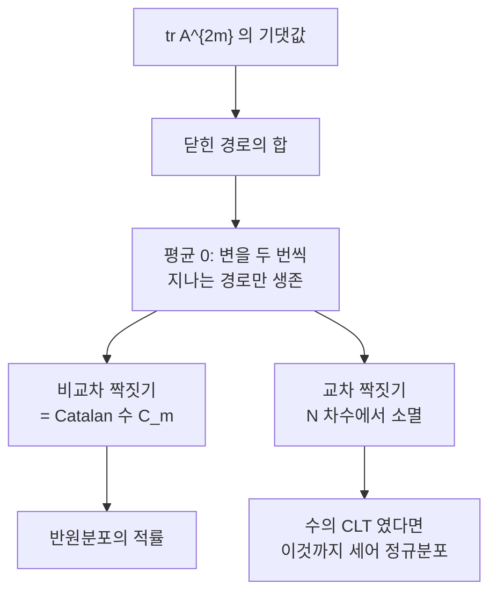

# Wigner 반원법칙

# 개요

$N\times N$ 실 대칭행렬의 성분을 평균 0, 분산 1 로 독립하게 뽑고 $\sqrt N$ 으로 나누면 [고윳값](eigenvalues.md)의 경험분포가 다음으로 수렴한다.

$$
\rho_{\mathrm{sc}}(x) = \frac{1}{2\pi}\sqrt{4 - x^2}, \qquad x \in [-2, 2]
$$

이것이 **반원법칙**이다. 극한이 성분의 분포에 의존하지 않는다는 점에서 [중심극한정리](central-limit-theorem.md)와 같은 성격의 보편성 정리다.

독립인 수를 더하면 정규분포가 나오고, 독립인 행렬을 더하면 반원분포가 나온다. 행렬의 곱셈이 가환이 아니어서 독립의 자리를 **자유독립**이 대신하고 극한분포가 바뀐다. Wigner 가 1955 년 원자핵의 준위 통계를 설명하려고 도입했고 지금은 그래프 스펙트럼, 자료분석, 수론에 쓰인다.

# 직관

## 적률과 닫힌 경로

$A$ 를 규격화한 Wigner 행렬이라 하면 다음이 성립한다.

$$
\frac{1}{N}\mathbb E\bigl[\mathrm{tr}A^{k}\bigr]
= \frac{1}{N^{1+k/2}}\sum_{i_1,\dots,i_k}\mathbb E\bigl[a_{i_1i_2}a_{i_2i_3}\cdots a_{i_ki_1}\bigr]
$$

오른쪽 합은 $\lbrace 1,\dots,N\rbrace$ 위의 길이 $k$ 짜리 닫힌 경로 전부를 훑는다. 성분의 평균이 0 이므로 어떤 변을 한 번만 지나는 경로는 기댓값이 0 이고, 살아남으려면 모든 변을 정확히 두 번씩 지나야 한다. 따라서 $k$ 가 홀수면 기여가 없다.

$k=2m$ 일 때 남는 경로는 $m$ 개의 변으로 된 나무를 한 바퀴 도는 경로이고, 그 개수가 **Catalan 수** $C_m=\frac{1}{m+1}\binom{2m}{m}$ 이다. 정점을 고르는 방법이 $N^{m+1}$ 가지이고 규격화 인자가 $N^{-(1+m)}$ 이므로 극한에서 다음이 남는다.

$$
\lim_{N\to\infty}\frac1N\mathbb E\bigl[\mathrm{tr}A^{2m}\bigr] = C_m
$$

반원분포의 $2m$ 번째 적률이 $C_m$ 이므로 증명이 끝난다. 살아남는 항은 각 변을 두 번 쓰므로 분산만 관여하고 네 번 이상 쓰는 항은 $N$ 의 거듭제곱에서 밀리므로, 성분의 세부 분포가 극한에 나타나지 않는다.

## 정규분포와의 차이

수의 중심극한정리에서는 모든 짝짓기가 기여해 $2m$ 번째 적률이 $(2m-1)!!$ 이 되고 정규분포가 나온다. 행렬에서는 교차하는 짝짓기가 $N$ 의 차수에서 밀려나고 비교차 짝짓기만 남아 개수가 $C_m$ 으로 줄어든다. 두 분포의 차이는 교차를 허용하는지에 있다.

# 정의

## Wigner 행렬

실 대칭 $N\times N$ 행렬 $H$ 의 성분 $\lbrace h_{ij}\rbrace\_{i\le j}$ 가 독립이고 $i<j$ 마다 $\mathbb E h_{ij}=0$ , $\mathbb E h_{ij}^2=1$ 이며 대각 성분의 분산과 모든 적률이 유한할 때 $H$ 를 **Wigner 행렬**이라 한다. 규격화는 $A=H/\sqrt N$ 이고, 이때 $\frac1N\mathbb E\mathrm{tr}A^2=\frac{1}{N^2}\sum_{i,j}\mathbb E h_{ij}^2\to1$ 로 2 차 적률이 $N$ 과 무관하게 유한하다.

고윳값 $\lambda_1\le\cdots\le\lambda_N$ 에 대해 **경험스펙트럼측도**를 다음으로 둔다.

$$
\mu_N = \frac1N\sum_{i=1}^{N}\delta_{\lambda_i}
$$

반원법칙은 $\mu_N$ 이 $\rho_{\mathrm{sc}}$ 로 약수렴한다는 주장이고, 거의 확실한 수렴까지 성립한다.

## Stieltjes 변환

측도 $\mu$ 의 **Stieltjes 변환**을 $z\in\mathbb C^+$ 에 대해 다음으로 정의한다.

$$
m_\mu(z) = \int \frac{d\mu(x)}{x - z} = \frac1N\mathrm{tr}\bigl(A - zI\bigr)^{-1}
$$

$\lim_{\eta\to0}\frac1\pi\mathrm{Im}m(x+i\eta)=\rho(x)$ 로 측도를 유일하게 결정하고, 약수렴이 각 $z$ 에서의 수렴과 동치이므로 수렴 증명의 표준 도구다.

레졸벤트의 대각 성분을 Schur 보완으로 전개하면 $N\to\infty$ 에서 자기무모순 방정식이 나온다.

$$
m(z) = \frac{1}{-z - m(z)}, \qquad\text{즉}\qquad m^2 + zm + 1 = 0
$$

행 하나를 지운 나머지 행렬이 같은 종류이고 같은 극한을 갖는다는 관찰이 이 닫힘의 내용이다. 무한대에서 $m\sim-1/z$ 인 가지를 고르면

$$
m(z) = \frac{-z + \sqrt{z^2-4}}{2}
$$

이고, 허수부를 취하면 반원밀도가 나온다.

# 성질

## 적률과 Catalan 수

$$
\int_{-2}^{2}x^{2m}\rho_{\mathrm{sc}}(x)\thinspace dx = C_m = \frac{1}{m+1}\binom{2m}{m}, \qquad \int x^{2m+1}\rho_{\mathrm{sc}} = 0
$$

곧 짝수 적률이 $1,2,5,14,42,132,\dots$ 이다.

## 가장자리

반원의 받침은 $[-2,2]$ 이고 밀도가 양 끝에서 $\sqrt{2-\lvert x\rvert}$ 로 사라진다. 최대 고윳값은 $2$ 로 수렴하고 그 요동은 $N^{-2/3}$ 규모에서 보이며 극한이 [Tracy–Widom 분포](tracy-widom.md)다. 반원법칙이 큰 수의 법칙에 해당하고 Tracy–Widom 이 가장자리의 요동 정리에 해당한다.

받침 밖에 고윳값이 나타나기도 한다. 낮은 계수의 결정론적 섭동을 더하면 그 크기가 임계값을 넘는 순간 고윳값 하나가 반원에서 떨어져 나온다(BBP 전이). 자료분석에서 신호를 검출하는 원리가 이것이다.

## 자유확률에서의 자리

비가환 확률공간에서 **자유독립**이 고전적 독립을 대신한다. 자유독립인 성분들의 규격화된 합은 반원분포로 수렴하고(자유 중심극한정리), 이 뜻에서 반원분포가 자유확률의 정규분포다. 자유 누율에서 2 차만 0 이 아닌 분포가 반원분포이고, 고전 누율에서 2 차만 0 이 아닌 것이 정규분포다. 큰 무작위 행렬들이 점근적으로 자유독립이라는 Voiculescu 의 정리가 두 세계를 잇는다.

# 활용

- 원래 동기는 무거운 원자핵의 에너지 준위였다. Hamilton 연산자의 행렬 성분을 무작위로 놓고 통계만 예측하는 방식이었고, 준위 간격의 분포가 실측과 맞았다.
- 무작위 그래프의 인접행렬 스펙트럼이 반원법칙을 따르고, 그 가장자리 성질이 [Expander 그래프](expander-graphs.md)의 스펙트럼 간극과 연결된다.
- 자료분석에서는 표본공분산행렬의 고윳값 분포([Marchenko–Pastur 법칙](marchenko-pastur.md))를 잡음의 기준선으로 삼아 주성분의 유의성을 판정한다.
- 무선통신의 채널 용량, 무질서계의 국소화, Riemann 제타함수 영점의 간격 통계에서도 같은 종류의 예측이 쓰인다.[^1]

[^1]: Greg W. Anderson, Alice Guionnet, Ofer Zeitouni, *An Introduction to Random Matrices*, Cambridge (2010), §2.1 (적률법에 의한 반원법칙), §2.4 (Stieltjes 변환과 자기무모순 방정식).

# 연관 문서

## 선수지식

- [고윳값과 고유벡터](eigenvalues.md)
- [중심극한정리](central-limit-theorem.md)

## 더 알아보기

- [Marchenko–Pastur 법칙](marchenko-pastur.md)
- [Tracy–Widom 분포와 Airy 핵](tracy-widom.md)

#probability #linear_algebra #theorem
