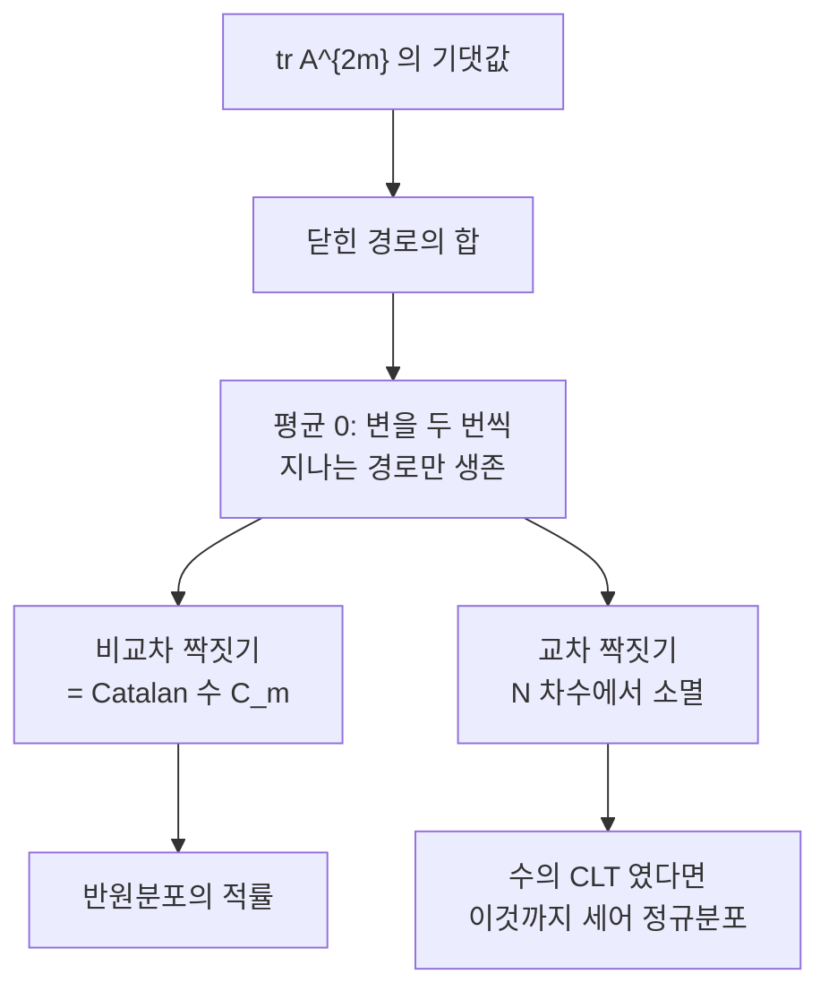

# Wigner 반원법칙

# 개요

성분을 독립으로 무작위하게 뽑은 큰 대칭행렬의 [고윳값](eigenvalues.md)들은 어떻게 퍼져 있는가. 놀랍게도 답이 성분의 분포와 거의 무관하다. $N \times N$ 실 대칭행렬의 성분을 평균 0, 분산 1 로 독립하게 뽑고 $\sqrt N$ 으로 나누면, 고윳값의 경험분포가

$$
\rho_{\mathrm{sc}}(x) = \frac{1}{2\pi}\sqrt{4 - x^2}, \qquad x \in [-2, 2]
$$

로 수렴한다. 이것이 **반원법칙**이다. 성분이 정규분포든 동전던지기든 결과가 같다는 점에서 [중심극한정리](central-limit-theorem.md)와 같은 성격의 보편성 정리이고, 무작위 행렬 이론의 출발점이다.

중심극한정리와 다른 점이 하나 있다. 독립인 수를 더하면 정규분포가 나오지만, 독립인 행렬을 더하면 반원분포가 나온다. 행렬은 곱셈이 가환이 아니어서 "독립" 의 의미 자체가 달라지고, 그 자리를 **자유독립**이 대신하며 극한이 정규분포에서 반원분포로 바뀐다. Wigner 가 1955년 원자핵의 준위 통계를 설명하려고 도입한 이 법칙이 지금은 그래프 스펙트럼, 자료분석, 수론에 두루 쓰인다.

# 직관

## 적률을 세면 경로가 세어진다

$A$ 를 규격화한 Wigner 행렬이라 하면

$$
\frac{1}{N}\mathbb E\bigl[\operatorname{tr}A^{k}\bigr]
= \frac{1}{N^{1+k/2}}\sum_{i_1,\dots,i_k}\mathbb E\bigl[a_{i_1i_2}a_{i_2i_3}\cdots a_{i_ki_1}\bigr]
$$

이다. 오른쪽 합은 $\{1,\dots,N\}$ 위의 길이 $k$ 짜리 닫힌 경로 전부를 훑는다. 성분의 평균이 0 이므로, 어떤 변을 한 번만 지나는 경로는 기댓값이 0 이 되어 사라진다. 살아남으려면 모든 변을 정확히 두 번씩 지나야 하고, 그래서 $k$ 가 홀수면 기여가 없다.

$k = 2m$ 일 때 남는 경로는 변을 두 번씩 쓰며 원점으로 돌아오는 것, 즉 $m$ 개의 변으로 된 나무를 한 바퀴 도는 경로다. 그런 경로의 개수가 **Catalan 수** $C_m = \frac{1}{m+1}\binom{2m}{m}$ 이다. 정점을 고르는 방법이 $N^{m+1}$ 가지이고 규격화 인자가 $N^{-(1+m)}$ 이라 딱 맞아떨어져, 극한에서

$$
\lim_{N\to\infty}\frac1N\mathbb E\bigl[\operatorname{tr}A^{2m}\bigr] = C_m
$$

이 남는다. 반원분포의 $2m$ 번째 적률이 정확히 $C_m$ 이므로 증명이 끝난다. 성분의 세부 분포가 사라지는 이유도 여기서 보인다. 살아남는 항은 각 변을 정확히 두 번 쓰므로 분산만 관여하고, 네 번 이상 쓰는 항은 $N$ 의 거듭제곱에서 밀려난다.

## 왜 정규분포가 아닌가

수의 CLT 에서는 모든 짝짓기가 기여해 $2m$ 번째 적률이 $(2m-1)!! $ 이 되고 정규분포가 나온다. 행렬에서는 **교차하는** 짝짓기가 $N$ 의 차수에서 밀려나 사라지고, **비교차** 짝짓기만 남아 개수가 $C_m$ 으로 줄어든다. 정규분포와 반원분포의 차이는 정확히 "교차를 허용하는가" 의 차이다.



# 정의

## Wigner 행렬

실 대칭 $N\times N$ 행렬 $H$ 의 성분 $\{h_{ij}\}_{i\le j}$ 가 독립이고 $\mathbb E h_{ij}=0$, $\mathbb E h_{ij}^2 = 1$ ($i<j$), 대각 성분의 분산이 유한하며 모든 적률이 유한할 때 $H$ 를 **Wigner 행렬**이라 한다. 규격화는 $A = H/\sqrt N$ 로 한다. 이 규격화가 옳은 이유는 $\frac1N\mathbb E\operatorname{tr}A^2 = \frac{1}{N^2}\sum_{i,j}\mathbb E h_{ij}^2 \to 1$ 로 2차 적률이 $N$ 과 무관하게 유한해지기 때문이다.

고윳값 $\lambda_1 \le \cdots \le \lambda_N$ 에 대해 **경험스펙트럼측도**를

$$
\mu_N = \frac1N\sum_{i=1}^{N}\delta_{\lambda_i}
$$

로 둔다. 반원법칙은 $\mu_N$ 이 $\rho_{\mathrm{sc}}$ 로 약수렴한다는 주장이고, 거의 확실한 수렴까지 성립한다.

## Stieltjes 변환

측도 $\mu$ 의 **Stieltjes 변환**을 $z \in \mathbb C^+$ 에 대해

$$
m_\mu(z) = \int \frac{d\mu(x)}{x - z} = \frac1N\operatorname{tr}\bigl(A - zI\bigr)^{-1}
$$

로 정의한다. 측도를 유일하게 결정하고($\lim_{\eta\to0}\frac1\pi\operatorname{Im}m(x+i\eta) = \rho(x)$), 약수렴이 각 $z$ 에서의 수렴과 동치이므로 수렴 증명의 표준 도구다.

레졸벤트의 대각 성분을 Schur 보완으로 전개하면 $N \to \infty$ 에서 자기무모순 방정식

$$
m(z) = \frac{1}{-z - m(z)}, \qquad\text{즉}\qquad m^2 + zm + 1 = 0
$$

이 나온다. 행 하나를 지웠을 때 나머지 행렬이 여전히 같은 종류이고 같은 극한을 가진다는 관찰이 이 닫힘의 내용이다. 풀면

$$
m(z) = \frac{-z + \sqrt{z^2-4}}{2}
$$

이고(무한대에서 $m \sim -1/z$ 인 가지), 허수부를 취하면 반원밀도가 그대로 나온다.

# 성질

## 적률과 Catalan 수

$$
\int_{-2}^{2}x^{2m}\rho_{\mathrm{sc}}(x)\,dx = C_m = \frac{1}{m+1}\binom{2m}{m}, \qquad \int x^{2m+1}\rho_{\mathrm{sc}} = 0
$$

이다. $1, 2, 5, 14, 42, 132$ 라는 익숙한 수열이 스펙트럼 분포의 적률로 나타난다. 아래 코드에서 이것을 직접 확인한다.

## 가장자리와 그 너머

반원의 받침은 $[-2,2]$ 이고, 밀도가 양 끝에서 $\sqrt{2-\lvert x\rvert}$ 로 사라진다. 최대 고윳값은 $2$ 로 수렴하지만, 그 요동은 반원법칙이 말해 주지 않는다. $N^{-2/3}$ 규모로 확대해야 보이고 극한이 [Tracy–Widom 분포](tracy-widom.md)다. 반원법칙이 큰 수의 법칙에 해당한다면 Tracy–Widom 은 가장자리에서의 요동 정리에 해당한다.

받침 밖에 고윳값이 나타나는 경우도 있다. 행렬에 낮은 계수의 결정론적 섭동을 더하면, 그 크기가 임계값을 넘는 순간 고윳값 하나가 반원에서 떨어져 나온다(BBP 전이). 자료분석에서 "신호" 를 검출하는 원리가 이것이다.

## 자유확률에서의 자리

비가환 확률공간에서 **자유독립**은 고전적 독립을 대신한다. 자유독립인 성분들의 규격화된 합은 반원분포로 수렴하며(자유 CLT), 이런 뜻에서 반원분포는 자유확률의 정규분포다. 자유 누율로 말하면 2차 누율만 0 이 아닌 분포가 반원분포이고, 고전 누율에서 2차만 0 이 아닌 것이 정규분포인 것과 나란하다. 큰 무작위 행렬들이 점근적으로 자유독립이라는 Voiculescu 의 정리가 두 세계를 잇는다.

# 활용

## 적률을 직접 세어 본다

행렬의 자취를 계산해 적률이 Catalan 수로 가는지 확인한다. 성분 분포를 정규분포와 동전던지기 두 가지로 바꿔 보편성도 함께 본다.

```python
import math, random

def matmul(A, B):
    Bt = list(zip(*B))
    return [[sum(a * b for a, b in zip(row, col)) for col in Bt] for row in A]

def wigner(N, rng, bernoulli=False):
    """성분을 정규분포 또는 ±1 에서 뽑고 sqrt(N) 으로 규격화."""
    draw = (lambda: rng.choice((-1.0, 1.0))) if bernoulli else (lambda: rng.gauss(0, 1))
    A = [[0.0] * N for _ in range(N)]
    for i in range(N):
        A[i][i] = draw() / math.sqrt(N)
        for j in range(i + 1, N):
            A[i][j] = A[j][i] = draw() / math.sqrt(N)
    return A

def catalan(m):
    return math.comb(2 * m, m) // (m + 1)

N, S, K = 120, 4, 6
rng = random.Random(3)
print("성분분포      " + "".join(f"  tr A^{2*m:<2d}" for m in range(1, K + 1)))
for bern in (False, True):
    acc = [0.0] * (K + 1)
    for _ in range(S):
        A = wigner(N, rng, bern)
        P = [[1.0 if i == j else 0.0 for j in range(N)] for i in range(N)]
        for m in range(1, K + 1):
            P = matmul(matmul(P, A), A)
            acc[m] += sum(P[i][i] for i in range(N)) / N
    name = "±1 동전" if bern else "정규분포"
    print(f"{name:10s}  " + "".join(f"{acc[m]/S:8.2f}" for m in range(1, K + 1)))
print(f"{'Catalan':10s}  " + "".join(f"{catalan(m):8d}" for m in range(1, K + 1)))
```

$N = 120$, 표본 네 개로 $1, 2, 5$ 까지는 1% 안쪽으로 맞고 $14$ 부터 3% 안팎, $42$ 와 $132$ 에서 5% 정도 어긋난다. 유한크기 보정이 $O(1/N)$ 이고 차수가 높을수록 그 계수가 커지기 때문이다. 두 성분분포의 결과가 서로 다른 방향으로 벗어나 있지만 벌어진 폭이 표본 네 개의 변동 규모와 같으므로, 성분의 분포가 아니라 표본 수가 오차를 지배한다고 읽어야 한다. 분산만 맞으면 나머지는 극한에 영향을 주지 않는다는 것이 보편성의 내용이다.

## 어디에 쓰이는가

원래 동기는 무거운 원자핵의 에너지 준위였다. Hamilton 연산자를 정확히 쓸 수 없으니 그 행렬 성분을 무작위로 놓고 통계만 예측하자는 발상이었고, 준위 간격의 분포가 실측과 맞았다.

지금은 훨씬 넓게 쓰인다. 무작위 그래프의 인접행렬 스펙트럼이 반원법칙을 따르고, 그 가장자리 성질이 [Expander 그래프](expander-graphs.md)의 스펙트럼 간극과 직결된다. 자료분석에서는 표본공분산행렬의 고윳값 분포(Marchenko–Pastur 법칙, 반원법칙의 사촌)를 잡음의 기준선으로 삼아 주성분의 유의성을 판정한다. 무선통신의 채널 용량, 무질서계의 국소화, 심지어 Riemann 제타함수 영점의 간격 통계에서도 같은 종류의 예측이 쓰인다.[^1]

[^1]: Greg W. Anderson, Alice Guionnet, Ofer Zeitouni, *An Introduction to Random Matrices*, Cambridge (2010), §2.1 (적률법에 의한 반원법칙), §2.4 (Stieltjes 변환과 자기무모순 방정식).

# 연관 문서

## 선수지식

- [고윳값과 고유벡터](eigenvalues.md)
- [중심극한정리](central-limit-theorem.md)

## 더 알아보기

- [Tracy–Widom 분포와 Airy 핵](tracy-widom.md)

#probability #linear_algebra #theorem
