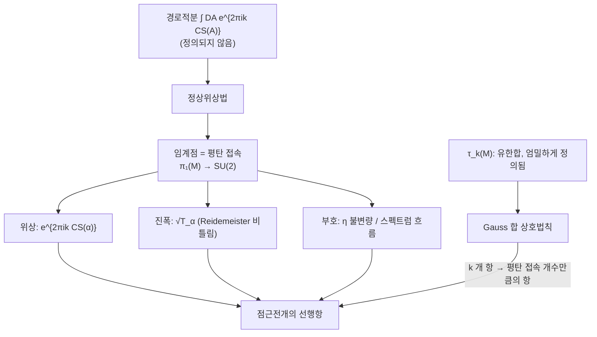

# Witten 점근 추측과 Ohtsuki 급수

# 개요

[Reshetikhin–Turaev 불변량](reshetikhin-turaev.md) $\tau_k(M)$ 의 정의는 대수적이다. 모듈러 텐서범주의 $S$ 행렬과 비틀림을 수술 링크 위에서 유한합으로 묶으면 수 하나가 나오지만, 그 수가 $M$ 의 어떤 기하를 담는지는 정의에 나타나지 않는다.

Witten 의 답은 $k\to\infty$ 에 있다. 그 극한에서 $\tau_k(M)$ 은 $M$ 위의 평탄 $\mathrm{SU}(2)$ 접속마다 붙는 항들의 합으로 분해되고, 각 항의 위상은 그 접속의 Chern–Simons 작용값, 진폭은 Reidemeister 비틀림이다.

증명 대상은 RT 불변량이고, 답을 적는 언어는 [Chern–Simons 이론](chern-simons.md)의 평탄 접속과 작용값이며, 답의 모양을 예언하는 어림은 [정상위상법](stationary-phase.md)이다.

증명이 되는 경우에 실제로 쓰이는 도구는 [이차 Gauss 합](gauss-sums.md)의 상호법칙이다. 상호법칙은 $O(k)$ 개 항의 합을 $O(p)$ 개 항의 합으로 바꾸며, 왼쪽은 정의이고 오른쪽은 평탄 접속들이다. 렌즈 공간에서 점근 추측이 참인 근거가 [이차 상호법칙](quadratic-reciprocity.md) 배후의 항등식이다.

# 직관

## 임계점으로서의 평탄 접속

Witten 의 출발점은 다음 형식적 적분이다.

$$
Z_k(M)=\int_{\mathcal A/\mathcal G}\mathcal DA\thickspace e^{2\pi ik\thinspace\mathrm{CS}(A)},\qquad
\mathrm{CS}(A)=\frac1{8\pi^2}\int_M\mathrm{tr}\Big(A\wedge dA+\tfrac23A\wedge A\wedge A\Big)
$$

측도가 정의되지 않으므로 이 식은 증명의 재료가 아니지만 큰 $k$ 에서의 형태를 지정한다. 진동적분 $\int e^{ikf}$ 의 큰 $k$ 거동은 $f$ 의 임계점이 지배하고, Chern–Simons 범함수의 변분은

$$
\delta\thinspace\mathrm{CS}(A)\propto\int\mathrm{tr}(\delta A\wedge F_A)
$$

이므로 임계점은 $F_A=0$ , 곧 **평탄 접속**이다. 평탄 접속의 게이지류는 $\pi_1(M)\to\mathrm{SU}(2)$ 준동형의 켤레류와 같으므로 유한하거나 유한차원이고, 무한차원 적분이 $\pi_1$ 의 표현으로 내려온다.

각 임계점의 기여는 정상위상법의 표준형을 따른다. 위상은 임계값 $e^{2\pi ik\thinspace\mathrm{CS}(\alpha)}$ 이고 진폭은 2 차 변분의 행렬식의 $-1/2$ 승이다. 그 행렬식을 정규화하면 비꼬인 de Rham 복합체의 [Reidemeister 비틀림](reidemeister-torsion.md) $T_\alpha$ 가 되고, 행렬식의 부호에서 스펙트럼 흐름(Atiyah–Patodi–Singer 의 $\eta$ 불변량)이 위상으로 따라 나온다.

## Gauss 합 상호법칙

$\tau_k$ 의 정의는 $k+1$ 개 라벨에 대한 합이고, $q=e^{2\pi i/(k+2)}$ 가 1 의 거듭제곱근이므로 그 합이 **이차 Gauss 합**이다. Gauss 합에는 상호법칙이 있다.

$$
\sum_{a=0}^{|C|-1}e^{\pi i(Aa^2+Ba)/C}
=\Big|\frac CA\Big|^{1/2}e^{\pi i\left(\mathrm{sgn}(AC)-B^2/(AC)\right)/4}\sum_{b=0}^{|A|-1}e^{-\pi i(Cb^2+Bb)/A}
$$

왼쪽 항의 개수는 $|C|$ 이고 오른쪽은 $|A|$ 다. 렌즈 공간 $L(p,1)$ 에서는 $C\sim2k$ 이고 $A=p$ 이므로 $k$ 에 비례하는 개수의 항이 $p$ 개의 항으로 바뀌고, $\pi_1(L(p,1))=\mathbb Z/p$ 의 $\mathrm{SU}(2)$ 표현도 그만큼 있다.

안장점 근사는 어림이지만 상호법칙은 등식이다. 렌즈 공간에서 점근 추측이 참인 것은 그 근사가 정확하기 때문이다. 오른쪽 합의 각 항에서 $k$ 는 위상 $e^{-2\pi i(k+2)b^2/p}$ 안에만 들어 있고 그 위상의 $k$ 에 대한 기울기 $-b^2/p$ 가 평탄 접속 $\rho_b$ 의 Chern–Simons 값이다. 앞의 $\left|C/A\right|^{1/2}$ 가 $\sqrt k$ 스케일을 주고 계수의 $4\sin^2(2\pi b/p)$ 가 비틀림이다.

## 다른 방향의 극한

$q=e^h$ 로 두고 $h\to0$ 에서 형식적 멱급수로 전개할 수도 있다. 유리 호몰로지 구면 $M$ 에 대해

$$
\tau^{\mathrm{Ohtsuki}}(M)=\sum_{n\ge0}\lambda_n(M)\thinspace h^n
$$

이 되고 계수 $\lambda_n$ 이 **유한형 불변량**(Vassiliev 이론의 3 차원판)이다. 점근 추측이 여러 임계점의 기여를 모두 보는 반면 Ohtsuki 급수는 자명한 접속 하나 주위의 섭동전개를 본다. 첫 계수 $\lambda_1$ 이 [Casson 불변량](casson-invariant.md)의 상수배다.

# 정의

## 점근 추측

$M$ 을 닫힌 유향 3 차원 다양체, $\tau_k(M)$ 을 $\mathrm{SU}(2)\_k$ 의 RT 불변량이라 한다. $M$ 위의 평탄 $\mathrm{SU}(2)$ 접속의 게이지 동치류 모듈라이를 $\mathcal M(M)$ 이라 하고 그 점들이 고립되고 비퇴화라고 가정한다.

**추측 (Witten 1989).** $k\to\infty$ 에서 다음이 성립한다.

$$
\tau_k(M)\thickspace\sim\thickspace\sum_{\alpha\in\mathcal M(M)}e^{2\pi ik\thinspace\mathrm{CS}(\alpha)}\thickspace k^{(h^1_\alpha-h^0_\alpha)/2}\thickspace\sqrt{T_\alpha}\thickspace e^{i\pi I_\alpha/4}\cdot\big(c_\alpha+O(k^{-1})\big)
$$

$\mathrm{CS}(\alpha)\in\mathbb R/\mathbb Z$ 는 Chern–Simons 불변량, $T_\alpha$ 는 $\alpha$ 로 비꼰 Reidemeister 비틀림, $I_\alpha$ 는 스펙트럼 흐름에서 오는 정수, $h^i_\alpha$ 는 비꼰 코호몰로지의 차원이다. 세 자료가 모두 고전 위상수학의 양이고 $\mathrm{CS}$ 는 게이지 이론, $T$ 는 조합적 위상수학, $I$ 는 지표 이론에서 온다.

모듈라이가 고립되지 않으면 $\alpha$ 에 대한 합이 연결성분 위의 적분이 되고 멱 $k^{(h^1-h^0)/2}$ 가 그 성분의 차원을 읽는다. 자명한 접속은 $h^0\neq0$ 이라 따로 다루며 그 기여의 전개가 Ohtsuki 급수다.

## Ohtsuki 급수

**정리 (Ohtsuki 1996).** $M$ 이 유리 호몰로지 3 구면이면 $\lambda_n(M)\in\mathbb Q$ 들이 존재해 형식급수 $\sum_n\lambda_n(M)(q-1)^n$ 이 정의되고, 각 $\lambda_n$ 은 차수 $3n$ 의 유한형 불변량이다. 정규화를 맞추면 $\lambda_1=6\lambda_{\mathrm{Casson}}$ 이다.

계수가 유한형이라는 것은 매듭 수술의 유한 차수 차분에서 소멸한다는 뜻이고, 매듭 쪽 Vassiliev 불변량이 교차점 바꾸기의 차분으로 정의되는 구조가 한 차원 위에서 반복된다. 이 급수는 Le–Murakami–Ohtsuki 의 **LMO 불변량**으로 통합되었고, LMO 는 모든 유한형 불변량을 담는 보편적 대상이다.

# 성질

## 증명된 범위

| 다양체족 | 상태 | 방법 |
|---|---|---|
| 렌즈 공간 $L(p,q)$ | 증명됨 (정확한 등식) | Gauss 합 상호법칙 |
| Seifert 올다양체 | 증명됨 | 상호법칙 + Poisson 합 |
| 원환면 사상 원기둥 | 증명됨 | $\mathrm{SL}\_2(\mathbb Z)$ 표현의 명시적 대각화 |
| 쌍곡 다양체 | 수치 확인 | 점근 전개의 수치 계산 |

Jeffrey 가 렌즈 공간과 원환면 사상 원기둥에서 $\tau_k$ 의 닫힌 형태를 얻고 그것이 평탄 접속의 합과 일치함을 보였고, Rozansky, Lawrence–Rozansky, Hikami 가 Seifert 쪽을 처리했다. 공통 조건은 $\pi_1$ 이 충분히 작아 평탄 접속을 셀 수 있고 합이 Gauss 합으로 닫힌다는 것이다. 쌍곡 다양체에서는 모듈라이가 복잡하고 합이 닫힌 형태를 갖지 않는다.

## 볼륨 추측과의 관계

- **Witten 점근 추측**: 대상은 3 차원 다양체, 극한은 $k\to\infty$ 이며 $q=e^{2\pi i/(k+2)}\to1$ 이다. 답은 평탄 접속의 CS 값이다.
- [**볼륨 추측**](volume-conjecture.md): 대상은 $S^3$ 안의 매듭, 극한은 색 $N\to\infty$ 이고 $q$ 는 $N$ 제곱근에 고정된다. 답은 여집합의 쌍곡 부피다.

전자는 실수 위상을, 후자는 지수적 증가율을 본다. 전자에서 $|\tau_k|$ 는 다항식적으로 거동하고 후자에서는 지수적으로 폭발한다. 쌍곡 다양체에서 Witten 추측이 어려운 이유 가운데 하나는 그 영역에서 두 현상이 섞여 복소 안장점(비실수 CS 값)이 기여한다는 데 있다. 재정리(resurgence) 접근이 이 복소 안장점을 다룬다.

## 점근전개의 정확성

렌즈 공간에서는 점근전개가 유한 항에서 끝나고 오차가 0 이다. 정상위상법이 정확해지는 상황은 국소화 정리가 성립할 때이고, Seifert 다양체 위의 Chern–Simons 이론에서는 $S^1$ 작용에 대한 국소화가 일어난다. Duistermaat–Heckman 정확성의 무한차원 판본이다.

# 활용

- **고전 불변량의 계산.** $\tau_k$ 는 유한합이라 컴퓨터로 계산되고, 점근을 읽으면 Casson 불변량이나 CS 값처럼 직접 계산이 어려운 양을 얻는 경로가 생긴다.
- **다양체의 구별.** 한 레벨의 $\tau_k$ 가 두 다양체를 구별하지 못해도 점근이 다르면 구별된다. 모든 $k$ 를 함께 보아야 한다는 [RT 문서](reshetikhin-turaev.md)의 진술이 이 방향으로 구체화된다.
- **물리와의 사전.** 점근의 각 항이 Chern–Simons 이론의 고전해 하나에 대응한다. [정점작용소대수](vertex-operator-algebras.md) 쪽 자료가 3 차원 기하로 번역되는 사전의 한 항목이다.

# 연관 문서

## 선수지식

- [Reshetikhin–Turaev 불변량](reshetikhin-turaev.md)
- [Chern–Simons 이론과 레벨 양자화](chern-simons.md)
- [정상위상법과 안장점 근사](stationary-phase.md)

## 더 알아보기

아직 연결한 문서가 없다.

#topology #algebraic_topology #analysis #number_theory
