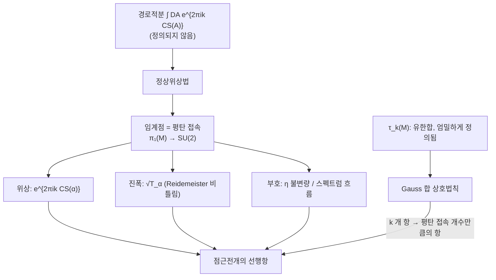

# Witten 점근 추측과 Ohtsuki 급수

# 개요

[Reshetikhin–Turaev 불변량](reshetikhin-turaev.md) $\tau_k(M)$ 은 정의가 완전히 대수적이다. 모듈러 텐서범주의 $S$ 행렬과 비틀림을 가지고 수술 링크 위에서 유한합을 하면 수 하나가 나온다. 그런데 그 수가 **$M$ 의 무엇을 세는지**는 정의 어디에도 적혀 있지 않다. 렌즈 공간의 값이 $-0.0542+0.0458i$ 라는 것을 알아도 그 수에서 $M$ 의 기하를 읽어 낼 길이 없다.

Witten 이 예언한 답은 이렇다. **레벨 하나만 보면 안 되고 $k\to\infty$ 를 보아야 한다.** 그 극한에서 $\tau_k(M)$ 은 $M$ 위의 평탄 $\mathrm{SU}(2)$ 접속 하나하나에 붙는 항들의 합으로 분해되고, 각 항의 위상은 그 접속의 Chern–Simons 작용값이며, 진폭은 Reidemeister 비틀림이다. 양자 불변량이 고전 위상수학을 담고 있다는 진술 가운데 가장 구체적인 것이다.

부모가 셋인 이유가 여기서 갈린다. 증명해야 할 **대상**이 RT 불변량이고, 답을 적는 **언어**가 [Chern–Simons 이론](chern-simons.md)이며 — 위 문장의 "Chern–Simons 작용값" 과 "평탄 접속" 이 전부 그쪽 낱말이다 — 답이 왜 저런 모양이어야 하는지 예언하는 **어림**이 [정상위상법](stationary-phase.md)이다.

한 가지가 더 필요하다. 위 주장은 물리에서는 안장점 근사로 한 줄에 나오지만, 수학적으로 증명된 경우는 많지 않다. 그리고 증명이 되는 경우에 실제로 쓰이는 도구가 [**이차 Gauss 합**](gauss-sums.md)의 상호법칙이다. 상호법칙은 $O(k)$ 개 항의 합을 $O(p)$ 개 항의 합으로 바꾼다. 왼쪽은 정의이고 오른쪽은 평탄 접속들이다. 점근 추측이 렌즈 공간에서 참인 이유가 [이차 상호법칙](quadratic-reciprocity.md)의 배후에 있는 바로 그 항등식인 셈이다.

# 직관

## 안장점이 평탄 접속인 이유

Witten 의 출발점은 다음 형식적 적분이다.

$$
Z_k(M)=\int_{\mathcal A/\mathcal G}\mathcal DA\;e^{2\pi ik\,\mathrm{CS}(A)},\qquad
\mathrm{CS}(A)=\frac1{8\pi^2}\int_M\mathrm{tr}\Big(A\wedge dA+\tfrac23A\wedge A\wedge A\Big)
$$

측도가 수학적으로 정의되지 않으므로 이 식 자체는 증명의 재료가 아니다. 그러나 **큰 $k$ 에서 무엇이 나와야 하는지**는 말해 준다. 진동적분 $\int e^{ik f}$ 의 큰 $k$ 거동은 $f$ 의 임계점이 지배한다. Chern–Simons 범함수의 변분은

$$
\delta\,\mathrm{CS}(A)\propto\int\mathrm{tr}(\delta A\wedge F_A)
$$

이므로 임계점은 $F_A=0$, 곧 **평탄 접속**이다. 평탄 접속의 게이지류는 $\pi_1(M)\to\mathrm{SU}(2)$ 준동형의 켤레류와 같으므로, 이것은 유한하거나 유한차원인 대상이다. 무한차원 적분이 $\pi_1$ 의 표현이라는 손에 잡히는 것으로 내려온다.

각 임계점의 기여는 정상위상법의 표준형을 따른다. 위상은 임계값 $e^{2\pi ik\,\mathrm{CS}(\alpha)}$, 진폭은 2 차 변분의 행렬식의 $-1/2$ 승이다. 그 행렬식이 정규화되면 비꼬인 de Rham 복합체의 Reidemeister 비틀림 $T_\alpha$ 가 되고, 행렬식의 부호에서 스펙트럼 흐름(Atiyah–Patodi–Singer 의 $\eta$ 불변량)이 위상으로 따라 나온다.



## 유한합에서 유한합으로

증명 쪽 그림이 이 다이어그램의 아래 줄이다. $\tau_k$ 의 정의는 $k+1$ 개 라벨에 대한 합이고, 그 합은 $q=e^{2\pi i/(k+2)}$ 가 1 의 거듭제곱근이므로 **이차 Gauss 합**이다. Gauss 합에는 상호법칙이 있다.

$$
\sum_{a=0}^{|C|-1}e^{\pi i(Aa^2+Ba)/C}
=\Big|\frac CA\Big|^{1/2}e^{\pi i\left(\mathrm{sgn}(AC)-B^2/(AC)\right)/4}\sum_{b=0}^{|A|-1}e^{-\pi i(Cb^2+Bb)/A}
$$

왼쪽 항의 개수는 $|C|$, 오른쪽은 $|A|$ 다. 렌즈 공간 $L(p,1)$ 에서는 $C\sim2k$ 이고 $A=p$ 이므로, **$k$ 에 비례하는 개수의 항이 $p$ 개의 항으로 정확히 바뀐다.** 그리고 $\pi_1(L(p,1))=\mathbb Z/p$ 의 $\mathrm{SU}(2)$ 표현도 정확히 그만큼 있다.

여기가 이 문서의 요점이다. 안장점 근사는 물리적 어림이지만, 상호법칙은 등식이다. 렌즈 공간에서 점근 추측이 참인 것은 **근사가 잘 맞아서가 아니라 근사가 정확하기 때문**이다. 오른쪽 합의 각 항에서 $k$ 는 위상 $e^{-2\pi i(k+2)b^2/p}$ 안에만 들어 있고, 그 위상의 $k$ 에 대한 기울기가 $-b^2/p$ 곧 평탄 접속 $\rho_b$ 의 Chern–Simons 값이다. 앞에 붙는 $\left|C/A\right|^{1/2}$ 가 $\sqrt k$ 스케일을 주고, 계수에서 튀어나오는 $4\sin^2(2\pi b/p)$ 가 비틀림이다.

## Ohtsuki 급수는 다른 극한이다

$k\to\infty$ 말고 다른 방향으로 갈 수도 있다. $q=e^h$ 로 두고 $h\to0$ 에서 형식적 멱급수로 전개하는 것이다. 유리 호몰로지 구면 $M$ 에 대해

$$
\tau^{\mathrm{Ohtsuki}}(M)=\sum_{n\ge0}\lambda_n(M)\,h^n
$$

이 되고, 계수 $\lambda_n$ 이 **유한형 불변량**(Vassiliev 이론의 3 차원판)이 된다. 점근 추측이 "여러 임계점의 기여를 모두 본다" 면 Ohtsuki 급수는 "자명한 접속 하나 주위의 섭동전개를 전부 본다" 이다. 같은 불변량을 두 방향에서 펼친 것이고, 첫 계수 $\lambda_1$ 이 Casson 불변량의 상수배라는 사실이 두 그림이 같은 대상을 본다는 첫 증거다.

# 정의

## 점근 추측

$M$ 을 닫힌 유향 3 차원 다양체, $\tau_k(M)$ 을 $\mathrm{SU}(2)_k$ 의 RT 불변량이라 한다. $M$ 위의 평탄 $\mathrm{SU}(2)$ 접속의 게이지 동치류 모듈라이를 $\mathcal M(M)$ 이라 하고, 당분간 그 점들이 고립되고 비퇴화라고 가정한다.

> **추측 (Witten 1989).** $k\to\infty$ 에서
> $$
> \tau_k(M)\;\sim\;\sum_{\alpha\in\mathcal M(M)}e^{2\pi ik\,\mathrm{CS}(\alpha)}\;k^{(h^1_\alpha-h^0_\alpha)/2}\;\sqrt{T_\alpha}\;e^{i\pi I_\alpha/4}\cdot\big(c_\alpha+O(k^{-1})\big)
> $$
> 여기서 $\mathrm{CS}(\alpha)\in\mathbb R/\mathbb Z$ 는 Chern–Simons 불변량, $T_\alpha$ 는 $\alpha$ 로 비꼰 Reidemeister 비틀림, $I_\alpha$ 는 스펙트럼 흐름에서 오는 정수, $h^i_\alpha$ 는 비꼰 코호몰로지의 차원이다.

세 자료가 전부 고전 위상수학의 양이라는 점이 핵심이다. $\mathrm{CS}$ 는 게이지 이론, $T$ 는 조합적 위상수학, $I$ 는 지표 이론에서 온다. 양자적으로 정의된 $\tau_k$ 하나가 이 셋을 동시에 안다.

모듈라이가 고립되지 않으면 $\alpha$ 에 대한 합이 연결성분 위의 적분으로 바뀌고, 멱 $k^{(h^1-h^0)/2}$ 가 그 성분의 차원을 읽는다. 자명한 접속은 언제나 $h^0\neq0$ 이라 따로 다루어야 하며, 그 기여의 전개가 바로 Ohtsuki 급수다.

## Ohtsuki 급수

$M$ 이 유리 호몰로지 3 구면일 때, Ohtsuki 는 소수 $p$ 마다 $\tau_p(M)$ 을 $p$ 진적으로 분해해 다음을 얻었다.

> **정리 (Ohtsuki 1996).** $\lambda_n(M)\in\mathbb Q$ 들이 존재해 형식급수 $\sum_n\lambda_n(M)(q-1)^n$ 이 정의되고, 각 $\lambda_n$ 은 차수 $3n$ 의 유한형 불변량이다. 정규화를 맞추면 $\lambda_1=6\lambda_{\mathrm{Casson}}$ 이다.

$q-1$ 전개의 계수가 유한형이라는 말은, 그 계수가 **매듭 수술의 유한 차수 차분에서 소멸**한다는 뜻이다. 매듭 쪽 Vassiliev 불변량이 교차점 바꾸기의 차분으로 정의되는 것과 같은 구조가 한 차원 위에서 반복된다. 이 급수는 뒤에 Le–Murakami–Ohtsuki 의 **LMO 불변량**으로 통합되었고, LMO 는 모든 유한형 불변량을 한꺼번에 담는 보편적 대상이다.

# 성질

## 어디까지 증명되었는가

| 다양체족 | 상태 | 방법 |
|---|---|---|
| 렌즈 공간 $L(p,q)$ | 증명됨 (정확한 등식) | Gauss 합 상호법칙 |
| Seifert 올다양체 | 증명됨 | 상호법칙 + Poisson 합 |
| 원환면 사상 원기둥 | 증명됨 | $\mathrm{SL}_2(\mathbb Z)$ 표현의 명시적 대각화 |
| 쌍곡 다양체 | 미해결 | 수치적 증거만 |

Jeffrey 가 렌즈 공간과 원환면 사상 원기둥에서 $\tau_k$ 의 정확한 닫힌 형태를 얻고 그것이 평탄 접속의 합과 일치함을 보였다. Rozansky, Lawrence–Rozansky, Hikami 가 Seifert 쪽을 처리했다. 공통점은 전부 **$\pi_1$ 이 충분히 작아 평탄 접속을 손으로 셀 수 있고, 합이 Gauss 합으로 닫힌다**는 것이다.

쌍곡 다양체에서는 두 조건이 다 깨진다. 평탄 접속의 모듈라이가 복잡하고, 합이 닫힌 형태를 갖지 않는다. 이쪽이 열려 있는 중심 문제다.

## 볼륨 추측과의 관계

이름이 비슷한 다른 점근이 있어 혼동하기 쉽다. 두 극한은 **다른 방향**이다.

- **Witten 점근 추측**: 대상은 3 차원 다양체, 극한은 $k\to\infty$ 이며 $q=e^{2\pi i/(k+2)}\to1$. 답은 평탄 접속의 CS 값들.
- **볼륨 추측**: 대상은 $S^3$ 안의 매듭, 극한은 색 $N\to\infty$ 이고 $q$ 는 $N$ 제곱근에 고정. 답은 여집합의 쌍곡 부피.

둘 다 "양자 불변량의 점근에서 기하가 나온다" 는 형태이지만, 전자는 **실수 위상**(CS 값)을, 후자는 **지수적 증가율**(부피)을 본다. 전자에서 $|\tau_k|$ 는 다항식적으로 거동하고 후자에서는 지수적으로 폭발한다. 쌍곡 다양체에서 Witten 추측이 어려운 까닭 가운데 하나가, 그 영역에서 두 현상이 섞여 복소 안장점(비실수 CS 값)이 기여하기 때문이다. 최근의 재정리(resurgence)적 접근은 이 복소 안장점을 정면으로 다룬다.

## 정확성이라는 예외

렌즈 공간에서 점근전개가 유한 항에서 끝나고 오차가 0 이라는 사실은 우연이 아니다. 정상위상법이 정확해지는 상황은 국소화 정리가 성립할 때인데, Chern–Simons 이론을 Seifert 다양체 위에서 볼 때 $S^1$ 작용에 대한 국소화가 실제로 일어난다. Duistermaat–Heckman 식 정확성의 무한차원 판이다. 아래 계산에서 "정확 대 선행항" 두 열이 갈리는 것이 이 이야기의 수치적 그림자다.

# 활용

## 렌즈 공간에서 직접 확인한다

주장 셋을 $\mathrm{SU}(2)_k$ 자료로 확인한다. 첫째, 정의대로의 $k+1$ 항 합이 상호법칙을 거쳐 **$p$ 항 합**과 정확히 같다. 둘째, 그 $p$ 개 항에서 위상의 $k$ 기울기가 Chern–Simons 값이고 계수가 비틀림이다. 셋째, 비틀림과 위상만 남긴 선행항의 상대오차가 $O(1/k)$ 로 줄어든다.

```python
from cmath import exp, pi
from math import sin, sqrt

def su2(k):
    """SU(2)_k 의 양자차원, 비틀림, 전체차원"""
    n = k + 2
    d = [sin(pi*(i+1)/n)/sin(pi/n) for i in range(k+1)]
    th = [exp(2j*pi*i*(i+2)/(4*n)) for i in range(k+1)]
    return d, th, 1/(sqrt(2/n)*sin(pi/n))

def tau_exact(k, p):
    """정의대로. L(p,1) = p-프레임 풀린 고리 수술, m=1, sigma=+1"""
    d, th, D = su2(k)
    F = sum(d[i]**2 * th[i]**p for i in range(k+1))      # k+1 개 항
    dp = sum(d[i]**2 * th[i] for i in range(k+1))        # Delta_+
    return F * D**-2 * (dp/D)**-1

def tau_recip(k, p):
    """상호법칙을 거친 판. 합의 항이 p 개로 줄어든다."""
    n, C = k+2, 2*(k+2)
    d, th, D = su2(k)
    dp = sum(d[i]**2 * th[i] for i in range(k+1))
    def G(c):                                            # A=p, B=4c, C=2n
        B, A = 4*c, p
        pref = sqrt(C/A) * exp(1j*pi*(1 - B*B/(A*C))/4)
        return pref * sum(exp(-1j*pi*(C*b*b + B*b)/A) for b in range(A))
    F = exp(-1j*pi*p/(2*n))/sin(pi/n)**2 * (2*G(0) - G(1) - G(-1))/8
    return F * D**-2 * (dp/D)**-1

def tau_leading(k, p):
    """평탄 접속의 기여만: 위상 = CS 값, 진폭 = 비틀림"""
    n = k + 2
    d, th, D = su2(k)
    dp = sum(d[i]**2 * th[i] for i in range(k+1))
    tot = sum(sin(2*pi*b/p)**2 * exp(-2j*pi*n*b*b/p) for b in range(p))
    return sqrt(2/(n*p)) * exp(1j*pi/4) * tot / (dp/D)

print("L(p,1):  k+1 개 항의 합  =  p 개 항의 합")
for p in [3, 5, 7, 11]:
    for k in [10, 60, 240]:
        e, r, l = tau_exact(k,p), tau_recip(k,p), tau_leading(k,p)
        print(f"  p={p:2d} k={k:3d}:  tau = {e:+.6f}"
              f"   |정확-상호법칙| = {abs(e-r):.1e}"
              f"   선행항 상대오차 = {abs(e-l)/abs(e):.3f}")
    print()

print("평탄 접속 rho_b 의 자료 (p=7)")
for b in range(7):
    print(f"  b={b}:  CS = -{b*b}/7 = {-(b*b % 7)/7:+.4f} (mod 1)"
          f"   비틀림 인자 4sin^2(2pi b/7) = {4*sin(2*pi*b/7)**2:.4f}")

# L(p,1):  k+1 개 항의 합  =  p 개 항의 합
#   p= 3 k= 10:  tau = +0.000000-0.353553j   |정확-상호법칙| = 9.5e-16   선행항 상대오차 = 0.390
#   p= 3 k= 60:  tau = +0.137305+0.076211j   |정확-상호법칙| = 5.0e-15   선행항 상대오차 = 0.093
#   p= 3 k=240:  tau = +0.068522+0.039167j   |정확-상호법칙| = 4.5e-15   선행항 상대오차 = 0.024
#
#   p= 5 k= 10:  tau = +0.000000+0.394338j   |정확-상호법칙| = 2.3e-15   선행항 상대오차 = 0.687
#   p= 5 k= 60:  tau = -0.042954+0.165898j   |정확-상호법칙| = 1.2e-14   선행항 상대오차 = 0.137
#   p= 5 k=240:  tau = -0.025455+0.082704j   |정확-상호법칙| = 1.0e-14   선행항 상대오차 = 0.035
#
#   p= 7 k= 10:  tau = +0.278839-0.278839j   |정확-상호법칙| = 4.7e-15   선행항 상대오차 = 0.922
#   p= 7 k= 60:  tau = +0.041840+0.067125j   |정확-상호법칙| = 6.4e-15   선행항 상대오차 = 0.184
#   p= 7 k=240:  tau = -0.054235+0.045776j   |정확-상호법칙| = 4.8e-15   선행항 상대오차 = 0.047
#
#   p=11 k= 10:  tau = +0.074715+0.074715j   |정확-상호법칙| = 5.7e-15   선행항 상대오차 = 1.397
#   p=11 k= 60:  tau = +0.119153+0.066135j   |정확-상호법칙| = 3.6e-15   선행항 상대오차 = 0.282
#   p=11 k=240:  tau = -0.007825-0.150552j   |정확-상호법칙| = 4.3e-14   선행항 상대오차 = 0.071
#
# 평탄 접속 rho_b 의 자료 (p=7)
#   b=0:  CS = -0/7 = +0.0000 (mod 1)   비틀림 인자 4sin^2(2pi b/7) = 0.0000
#   b=1:  CS = -1/7 = -0.1429 (mod 1)   비틀림 인자 4sin^2(2pi b/7) = 2.4450
#   b=2:  CS = -4/7 = -0.5714 (mod 1)   비틀림 인자 4sin^2(2pi b/7) = 3.8019
#   b=3:  CS = -9/7 = -0.2857 (mod 1)   비틀림 인자 4sin^2(2pi b/7) = 0.7530
#   b=4:  CS = -16/7 = -0.2857 (mod 1)   비틀림 인자 4sin^2(2pi b/7) = 0.7530
#   b=5:  CS = -25/7 = -0.5714 (mod 1)   비틀림 인자 4sin^2(2pi b/7) = 3.8019
#   b=6:  CS = -36/7 = -0.1429 (mod 1)   비틀림 인자 4sin^2(2pi b/7) = 2.4450
```

읽을 것이 네 가지다.

**정확-상호법칙 열이 전부 기계정밀도**다. $k=240$ 이면 왼쪽은 241 개 항의 합이고 오른쪽은 11 개 이하의 항의 합인데 값이 같다. 이것이 렌즈 공간에서 점근 추측이 참인 방식이다. 안장점 근사가 잘 맞는 것이 아니라, 상호법칙이 정의를 평탄 접속의 합으로 **다시 쓴다.** 3 차원 다양체 불변량 하나가 수론의 항등식 하나와 같은 내용이라는 뜻이다.

**선행항 상대오차가 $k$ 에 반비례**한다. $p=3$ 에서 $0.390\to0.093\to0.024$ 는 $k$ 가 $10\to60\to240$ 으로 24 배 될 때 오차가 16 배 줄어든 것이다. 추측의 $O(k^{-1})$ 보정항이 이렇게 보인다. 선행항 계산에서 버린 것은 상호법칙의 전위 인자 $e^{-\pi iB^2/(4AC)}$ 와 $e^{-i\pi p/(2n)}$ 처럼 $1/n$ 크기의 위상들뿐인데, 그것만으로 전개의 다음 차수가 전부 설명된다.

**$b$ 와 $p-b$ 가 같은 자료를 준다.** $p=7$ 표에서 $(1,6)$, $(2,5)$, $(3,4)$ 가 CS 값도 비틀림도 짝을 이룬다. $\mathbb Z/7\to\mathrm{SU}(2)$ 에서 $b$ 와 $-b$ 는 켤레인 표현이므로 **같은 평탄 접속**이기 때문이다. 합의 항 개수는 $p$ 지만 실제 평탄 접속은 $\lfloor p/2\rfloor+1$ 개이고, 상호법칙이 각 접속을 정확히 두 번씩 세고 있다. 대수적 항등식의 대칭성이 기하적 대상의 켤레 관계와 같다.

**$b=0$ 의 비틀림이 0 이다.** 자명한 접속이 이 규약에서 선행항에 기여하지 않는다. 자명 접속은 $h^0\neq0$ 이라 비퇴화 가정이 깨지고, 그 기여는 다른 멱 차수에 숨는다. 위에서 "자명 접속은 따로 다루어야 한다" 고 한 말이 여기 숫자 하나로 나타난다. 그리고 그 따로 다루는 방식이 바로 Ohtsuki 급수다.

## 어디에 쓰는가

- **고전 불변량의 계산.** $\tau_k$ 는 유한합이므로 컴퓨터로 계산된다. 점근을 읽으면 Casson 불변량이나 CS 값처럼 직접 계산이 어려운 양의 값을 얻는 경로가 생긴다.
- **완전성 검사.** 한 레벨의 $\tau_k$ 가 두 다양체를 구별하지 못해도, 점근이 다르면 구별된다. 모든 $k$ 를 함께 보아야 한다는 [RT 문서](reshetikhin-turaev.md)의 말이 이 방향으로 구체화된다.
- **물리와의 사전.** $\Delta_+/\mathcal D=e^{2\pi ic/8}$ 이 중심 전하를 아는 것과 같은 방식으로, 점근의 각 항은 Chern–Simons 이론의 고전해 하나에 대응한다. [정점작용소대수](vertex-operator-algebras.md) 쪽 자료가 3 차원 기하로 번역되는 사전의 한 항목이다.

[^1]: 원전은 E. Witten, *Quantum field theory and the Jones polynomial*, Comm. Math. Phys. 121 (1989), 특히 안장점 전개를 논한 4 절. 추측의 엄밀한 형태와 $\eta$ 불변량 항의 정리는 D. Freed–R. Gompf, *Computer calculation of Witten's 3-manifold invariant*, Comm. Math. Phys. 141 (1991) 에서 수치적으로 처음 검증되었다.
[^2]: 렌즈 공간과 원환면 사상 원기둥의 정확한 계산은 L. Jeffrey, *Chern–Simons–Witten invariants of lens spaces and torus bundles, and the semiclassical approximation*, Comm. Math. Phys. 147 (1992). Seifert 쪽은 L. Rozansky, *A large k asymptotics of Witten's invariant of Seifert manifolds*, Comm. Math. Phys. 171 (1995) 및 R. Lawrence–L. Rozansky, Comm. Math. Phys. 205 (1999).
[^3]: Ohtsuki 급수는 T. Ohtsuki, *A polynomial invariant of rational homology 3-spheres*, Invent. Math. 123 (1996). 보편적 통합은 T. Le–J. Murakami–T. Ohtsuki, *On a universal perturbative invariant of 3-manifolds*, Topology 37 (1998). 본문의 수치 계산과 상호법칙 적용은 직접 한 것이다.

# 연관 문서

## 선수지식

- [Reshetikhin–Turaev 불변량](reshetikhin-turaev.md)
- [Chern–Simons 이론과 레벨 양자화](chern-simons.md)
- [정상위상법과 안장점 근사](stationary-phase.md)

## 더 알아보기

아직 연결한 문서가 없다.

#topology #algebraic_topology #analysis #number_theory
