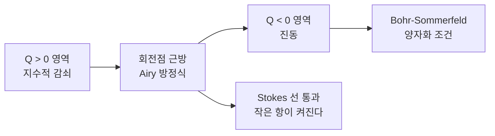

# WKB 근사와 연결 공식

# 개요

최고계 도함수 앞에 작은 매개변수가 붙은 미분방정식

$$
\epsilon^2 y''(x) = Q(x)\,y(x)
$$

는 [상미분방정식](ordinary-differential-equations.md)의 표준적인 해법이 통하지 않는다. $\epsilon \to 0$ 에서 방정식의 계수(階數)가 떨어지므로 정칙 섭동이 아니다. WKB 근사는 해를 거듭제곱이 아니라 **지수의 어깨 위에서** 전개해 이 특이성을 정면으로 다룬다.

결과는 $Q(x)^{-1/4}\exp\bigl(\pm\epsilon^{-1}\!\int\!\sqrt{Q}\bigr)$ 라는 한 줄짜리 공식이고, $Q$ 의 부호에 따라 지수적으로 감쇠하거나 진동한다. 문제는 그 부호가 바뀌는 **회전점**(turning point)에서 근사가 무너진다는 것이다. 회전점 양쪽의 해를 잇는 규칙이 **연결 공식**이며, 그것이 [Stokes 현상](stokes-phenomenon.md)의 가장 구체적인 얼굴이다. 감쇠하는 해와 진동하는 해는 서로 다른 함수가 아니라 같은 함수를 다른 영역에서 본 것이고, 그 사이에서 지수적으로 작은 항이 켜진다.

# 직관

## 느리게 변하는 매질 속의 파동

$Q < 0$ 인 영역에서 해는 파수 $k(x) = \sqrt{-Q(x)}/\epsilon$ 로 진동한다. 매질이 파장에 비해 느리게 변하면 파동은 국소적으로 평면파처럼 행동하고, 위상은 $\int k\,dx$ 로 누적된다. 진폭은 왜 $k^{-1/2}$ 인가. 흐르는 에너지가 보존되어야 하기 때문이다. 파수가 커지면 그만큼 진폭이 줄어야 $k \cdot (\text{진폭})^2$ 이 일정하다. 이 한 줄이 WKB 해의 앞인자 $Q^{-1/4}$ 의 물리적 내용 전부다.

## 회전점에서 왜 무너지는가

근사가 성립하려면 파장이 매질의 변화 규모보다 훨씬 작아야 한다. 회전점 $x_0$ 에서는 $Q(x_0) = 0$ 이라 파장이 무한대로 커지고, 이 조건이 깨진다. 그래서 회전점 부근만 따로 풀어야 한다. 그런데 $Q$ 를 $x_0$ 근처에서 선형으로 근사하면 방정식이 정확히 Airy 방정식이 되고, Airy 함수의 점근 거동은 이미 알려져 있다. 국소해와 양쪽 WKB 해를 겹치는 구간에서 맞추면 연결 공식이 나온다.



# 정의

## 지수 어깨 위의 전개

해를

$$
y(x) \;=\; \exp\left(\frac{1}{\epsilon}\sum_{n \ge 0}\epsilon^{n} S_n(x)\right)
$$

로 놓고 대입한 뒤 $\epsilon$ 의 거듭제곱별로 맞춘다. 최저 두 차수는

$$
(S_0')^2 = Q, \qquad 2S_0'S_1' + S_0'' = 0
$$

이다. 앞의 것을 **eikonal 방정식**, 뒤의 것을 **수송 방정식**이라 한다. 풀면 $S_0 = \pm\int^x \sqrt{Q}\,dt$ 이고 $S_1 = -\tfrac14 \log Q$ 이므로, 두 독립해가

$$
y_{\pm}(x) \;\sim\; \frac{1}{Q(x)^{1/4}}\exp\left(\pm\frac{1}{\epsilon}\int^{x}\sqrt{Q(t)}\,dt\right)
$$

로 나온다. $Q < 0$ 인 영역에서는 지수가 순허수가 되어 $\lvert Q\rvert^{-1/4}\cos$ 와 $\lvert Q \rvert^{-1/4}\sin$ 꼴의 진동해가 된다.

## 타당성 조건

전개가 점근적이려면 다음 차수가 앞 차수보다 작아야 한다. 조건은

$$
\epsilon\,\frac{\lvert Q' \rvert}{\lvert Q \rvert^{3/2}} \;\ll\; 1
$$

이고, 물리 표기로는 "파장이 그 자리에서 변하는 정도가 1 보다 훨씬 작다" 는 말이다. $Q \to 0$ 인 회전점에서 좌변이 발산하므로 근사가 깨진다.

## 회전점과 연결 공식

$Q(x_0) = 0$ 이고 $Q'(x_0) > 0$ 인 단순 회전점을 잡고 $Q(x) \approx Q'(x_0)(x - x_0)$ 로 근사하면 방정식이 Airy 방정식으로 바뀐다. $\operatorname{Ai}$ 의 두 방향 점근을 양쪽 WKB 해에 맞추면 다음 규칙을 얻는다. 아래에서 $\phi(x) = \epsilon^{-1}\bigl\lvert\int_{x_0}^{x}\sqrt{\lvert Q\rvert}\,dt\bigr\rvert$ 로 둔다.

| 감쇠 영역 ($Q>0$) | ↔ | 진동 영역 ($Q<0$) |
|---|---|---|
| $\dfrac{1}{2Q^{1/4}}e^{-\phi}$ | ↔ | $\dfrac{1}{\lvert Q\rvert^{1/4}}\cos\left(\phi - \dfrac{\pi}{4}\right)$ |
| $\dfrac{1}{Q^{1/4}}e^{+\phi}$ | ↔ | $\dfrac{-1}{\lvert Q\rvert^{1/4}}\sin\left(\phi - \dfrac{\pi}{4}\right)$ |

$\pi/4$ 만큼의 위상 이동이 연결 공식의 핵심이며, Airy 함수의 진동 쪽 점근에 들어 있는 상수가 그대로 옮겨 온 것이다.

방향에 주의해야 한다. 첫 줄은 감쇠해에서 진동해로 읽는 것이 안전하고, 반대로 읽으면 지수적으로 작은 항이 큰 항에 묻혀 계수가 결정되지 않는다. 이 비대칭이 바로 Stokes 현상이다. 작은 항의 계수는 Stokes 선을 건널 때 조용히 바뀌므로, 큰 항이 지배하는 쪽에서 출발해 추적할 수 없다.

# 성질

## 연결 공식은 Stokes 상수다

WKB 해 두 개는 [Stokes 현상](stokes-phenomenon.md)에서 말한 두 개의 지수항 $e^{\pm\phi}$ 에 대응한다. 회전점은 두 안장점이 합류하는 자리이고, 연결 공식의 계수 $\tfrac12$ 과 위상 $\pi/4$ 가 곧 이 배치의 Stokes 상수다. 급수 전체를 보면 각 영역의 WKB 급수는 발산하며, 그 발산률이 반대쪽 지수항의 크기를 가리킨다. 한쪽 급수의 계수 안에 다른 쪽 해가 들어 있다는 resurgence 의 전형적인 예다.

## Bohr–Sommerfeld 양자화

$Q(x) = \tfrac{2m}{\hbar^2}\bigl(V(x) - E\bigr)$ 로 두고 $\epsilon = \hbar$ 로 보면 정상상태 Schrödinger 방정식이 된다. 두 회전점 $a < b$ 사이에서 파동이 갇힌 경우, 양쪽에서 연결 공식을 적용해 같은 해가 되도록 요구하면

$$
\frac{1}{\hbar}\int_{a}^{b}\sqrt{2m\bigl(E - V(x)\bigr)}\;dx \;=\; \pi\left(n + \frac12\right), \qquad n = 0, 1, 2, \dots
$$

를 얻는다. 고전역학의 작용이 $\hbar$ 의 정수배가 아니라 반정수배라는 점이 WKB 가 주는 보정이고, $1/2$ 은 회전점 두 개에서 각각 $\pi/4$ 씩 받은 위상이다.

조화진동자에서는 이 조건이 정확한 고윳값 $E_n = \hbar\omega(n + \tfrac12)$ 을 그대로 준다. 근사식이 정확한 답을 주는 것은 우연이며(조화진동자의 WKB 급수는 최저 차수 이후가 모두 0), 일반적으로는 큰 $n$ 에서 좋은 근사다.

## 장벽 투과

$V > E$ 인 영역을 통과하는 확률은 감쇠해의 감쇠량으로 결정된다.

$$
T \;\approx\; \exp\left(-\frac{2}{\hbar}\int_{a}^{b}\sqrt{2m\bigl(V(x) - E\bigr)}\;dx\right)
$$

지수 안의 값이 $\hbar$ 로 나누어지므로 투과율은 고전적 극한에서 지수적으로 0 이 된다. $\alpha$ 붕괴의 수명이 에너지에 지수적으로 민감한 이유, 주사 터널링 현미경이 원자 한 층의 높이차를 읽는 이유가 모두 이 지수 하나에서 나온다.

# 활용

## 고윳값 점근의 빠른 계산

양자화 조건은 퍼텐셜 하나만 적분하면 되므로, 미분방정식을 수치로 풀지 않고도 고윳값의 점근을 얻는다. 아래에서 무한 우물과 조화진동자, 그리고 $V = \lvert x\rvert$ 에 대해 조건을 수치로 풀어 정확값과 비교한다.

```python
import math

def action(V, a, b, E, n_grid=4000):
    """작용 적분. 회전점의 제곱근 특이점을 sin 치환으로 없앤다."""
    c, r = (a + b) / 2, (b - a) / 2
    h = math.pi / n_grid
    total = 0.0
    for k in range(n_grid + 1):
        th = -math.pi / 2 + k * h
        x = c + r * math.sin(th)
        p = math.sqrt(max(0.0, 2 * (E - V(x))))
        w = 1.0 if 0 < k < n_grid else 0.5
        total += w * p * r * math.cos(th)
    return total * h

def level(V, turning, n, lo=1e-9, hi=1e3):
    """작용이 pi*(n+1/2) 가 되는 E 를 이분법으로 찾는다 (hbar = m = 1)."""
    target = math.pi * (n + 0.5)
    f = lambda E: action(V, *turning(E), E) - target
    for _ in range(200):
        mid = (lo + hi) / 2
        if f(mid) < 0:
            lo = mid
        else:
            hi = mid
    return (lo + hi) / 2

ho, ho_tp = (lambda x: 0.5 * x * x), (lambda E: (-math.sqrt(2 * E), math.sqrt(2 * E)))
lin, lin_tp = (lambda x: abs(x)), (lambda E: (-E, E))

print(" n   조화진동자 WKB      정확값        V=|x| 의 WKB")
for n in (0, 1, 2, 5):
    print(f"{n:2d}   {level(ho, ho_tp, n):.6f}      {n + 0.5:.6f}"
          f"      {level(lin, lin_tp, n):.6f}")
```

조화진동자에서는 모든 $n$ 에서 소수점 아래까지 일치한다. $V = \lvert x\rvert$ 의 정확한 준위는 Airy 함수의 영점으로 주어지며, $n = 0$ 에서는 정확값 $0.8086$ 에 대해 WKB 가 $0.8853$ 으로 9% 넘게 어긋나지만, $n = 5$ 에서는 정확값 $4.3817$ 에 대해 $4.3790$ 으로 0.1% 이내까지 좁혀진다. 낮은 준위에서 오차가 크고 큰 $n$ 에서 좋아지는 것이 이 근사의 성격이다.

## 파동이 있는 모든 곳

빛이 굴절률이 서서히 변하는 매질을 지날 때의 기하광학 극한, 지진파의 주시 곡선, 플라스마 안의 전파 차단층이 모두 같은 형태다. 회전점은 물리적으로 "파동이 되돌아오는 지점" 이고, 연결 공식은 그 반사에서 생기는 위상을 준다.

## 점근해석의 훈련장

WKB 는 특이 섭동의 가장 단순한 비자명 예다. 지수 어깨 위의 전개, 영역별 근사와 정합 전개, 국소적으로 정확히 풀리는 모형 방정식(여기서는 Airy), 그리고 연결 공식으로서의 Stokes 현상까지 점근해석의 주요 도구가 한 문제 안에 모두 등장한다.[^1]

[^1]: Carl M. Bender, Steven A. Orszag, *Advanced Mathematical Methods for Scientists and Engineers I*, Chapter 10 (WKB Theory), §§10.1–10.4. 지수 전개, 타당성 조건, 회전점과 연결 공식, 양자화 조건의 유도.

# 연관 문서

## 선수지식

- [상미분방정식](ordinary-differential-equations.md)
- [Airy 함수와 회전점](airy-functions.md)

## 더 알아보기

아직 연결한 문서가 없다.

#analysis #computation
