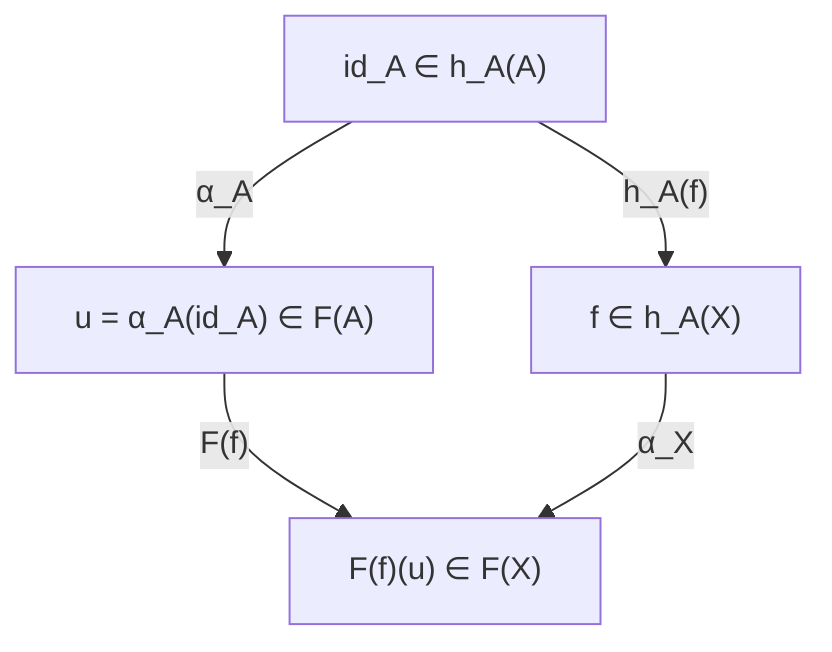

# Yoneda lemma

# 개요

어떤 대상이 무엇인지 알려면 그 안을 들여다보아야 한다는 것이 집합론의 관점이다. 범주론은 반대로 본다. 대상의 정체는 다른 대상들이 그것을 어떻게 보는지, 곧 그것으로 들어오는 사상 전체로 결정된다.

Yoneda lemma 는 이 태도가 정당하다는 정리다. `A` 로 들어오는 사상들의 모임 `h_A` 는 `A` 에 대한 정보를 하나도 잃지 않으며, 두 대상이 같은 방식으로 관찰되면 실제로 동형이다. [자연변환](natural-transformations.md)의 언어로 진술되고 증명은 몇 줄이지만, 범주론에서 대상을 다루는 방식 전체를 바꾸어 놓는다.

보편 성질로 정의한 대상의 유일성 증명, 표현가능 함자의 판정, 대수기하의 함자적 관점이 모두 이 정리의 응용이다.

# 직관

## 관찰로 정체를 결정한다

`Set` 에서 한 점 집합 `1` 에서 `A` 로 가는 사상은 `A` 의 원소와 같다. 군의 범주에서 `ℤ` 로부터의 준동형은 원소 하나를 고르는 것과 같고, 위상공간에서 점에서의 사상도 그렇다.

일반화하면 `X` 에서 `A` 로 가는 사상을 "`X` 모양의 관찰" 이라 부를 수 있다. Yoneda lemma 는 모든 모양의 관찰을 다 모으면 `A` 를 완전히 복원할 수 있다고 말한다. 물리학에서 대상을 직접 보지 않고 온갖 측정의 결과로 규정하는 것과 같은 발상이다.

## 증명은 항등사상 하나에 달려 있다

`h_A` 에서 출발하는 자연변환은 무한히 많은 성분을 가진 복잡한 대상처럼 보인다. 그런데 `α_A(id_A)` 하나만 알면 나머지가 전부 결정된다.

이유는 간단하다. `h_A(X)` 의 임의의 원소 `f : X → A` 는 `h_A(f)` 를 `id_A` 에 적용한 결과다. 자연성은 `α` 가 `h_A(f)` 와 교환한다고 말하므로, `α_X(f)` 가 `F(f)(α_A(id_A))` 로 강제된다.



사각형이 가환이라는 것이 자연성이고, 왼쪽 위에서 오른쪽 아래로 가는 두 길이 같다는 것이 `α_X(f) = F(f)(u)` 다. 항등사상이 "가장 일반적인 관찰" 이라는 점이 이 정리의 전부다.

# 정의

## 표현가능 함자

`C` 를 locally small 범주, `A` 를 `C` 의 대상이라 하자. `A` 로 향하는 사상들을 모아 반변 함자를 만든다.

$$
h_A(X)=\operatorname{Hom}_C(X,A)
$$

`f : X → Y` 에 대해 `h_A(f) : h_A(Y) → h_A(X)` 는 앞합성 `g ↦ g ∘ f` 다. 어떤 함자가 이런 꼴과 자연동형이면 표현가능하다고 하고 `A` 를 그 표현 대상이라 한다.

## 정리

`F : C^op → Set` 에 대해

$$
\operatorname{Nat}(h_A,F)\cong F(A)
$$

인 전단사가 있으며, `A` 와 `F` 양쪽에 대해 자연스럽다. 대응은 자연변환 `α` 를 `α_A(id_A)` 로 보낸다.

# 성질

## 증명

`u ∈ F(A)` 가 주어지면 `f : X → A` 에 대해

$$
\alpha_X(f)=F(f)(u)
$$

로 자연변환을 정의한다. 함자가 합성을 보존하므로 성분들이 자연성을 만족한다. 거꾸로 `α` 가 주어지면 `u = α_A(id_A)` 로 두고, 자연성 사각형을 `id_A` 에 적용하면 모든 `f` 에서 위 식이 강제된다. 두 구성이 서로 역이므로 전단사다.

증명에 쓰인 것은 함자성과 자연성뿐이다. 구체적인 범주의 성질을 전혀 쓰지 않으므로 결론이 모든 범주에서 성립한다.

## Yoneda 매장

`F = h_B` 로 두면

$$
\operatorname{Nat}(h_A,h_B)\cong\operatorname{Hom}_C(A,B)
$$

를 얻는다. 따라서 `A ↦ h_A` 로 주어지는 함자 `C → [C^op, Set]` 는 full 이고 faithful 하다. 이를 Yoneda 매장이라 하며, 임의의 범주를 함자 범주 안에 충실하게 집어넣을 수 있다는 뜻이다.

따름정리로 `h_A ≅ h_B` 이면 `A ≅ B` 다. 다만 각 `X` 에서 집합 `h_A(X)` 와 `h_B(X)` 의 크기만 우연히 같다는 사실로는 부족하다. 모든 사상과 양립하는 자연동형이 있어야 한다.

## 보편 성질의 유일성

보편 성질로 정의된 대상은 대개 "어떤 함자를 표현한다" 는 형태다. 곱 `A × B` 는 `X ↦ Hom(X,A) × Hom(X,B)` 를 표현하고, 자유군은 망각 함자의 왼쪽 수반으로 `X ↦ Hom_Set(S, U(X))` 를 표현한다.

표현 대상이 동형을 무시하고 유일하다는 것이 Yoneda 매장의 충실성에서 곧바로 나온다. 매번 "두 대상 사이에 사상을 만들고 합성이 항등임을 확인한다" 를 반복하지 않아도 되며, 이것이 이 정리가 실무에서 가장 많이 쓰이는 방식이다.

```python
# 유한 poset 을 범주로 보고 Yoneda 를 확인한다.
# 대상 x 에서 y 로 가는 사상은 x <= y 일 때 정확히 하나.
P = {"0": set(), "a": {"0"}, "b": {"0"}, "1": {"a", "b", "0"}}

def leq(x, y):
    """x <= y 인가. below[y] 는 y 아래 원소들."""
    return x == y or x in P[y]

def h(A):
    """h_A(X) = Hom(X, A): 비었거나 한 점."""
    return {X for X in P if leq(X, A)}

for A in P:
    print(A, "h_A =", sorted(h(A)))

# h_A = h_B 이면 A = B (poset 에서 동형은 상등)
pairs = [(A, B) for A in P for B in P if A < B and h(A) == h(B)]
print("h 가 같은 서로 다른 대상:", pairs)      # 없음

# Nat(h_A, h_B) 는 A <= B 일 때 한 원소, 아니면 빈 집합
for A in P:
    for B in P:
        nat = 1 if h(A) <= h(B) else 0
        hom = 1 if leq(A, B) else 0
        assert nat == hom, (A, B)
print("Nat(h_A, h_B) = Hom(A, B) 확인 완료")
```

poset 범주에서 `h_A` 는 "`A` 이하인 원소들의 집합" 이고, Yoneda 매장은 원소를 그 아래집합으로 보내는 사상이다. 순서를 아래집합의 포함으로 복원할 수 있다는 사실이 이 범주에서의 Yoneda lemma 이며, 격자 이론의 Dedekind–MacNeille 완비화가 같은 구성이다.

## 공변판과 밀도

공변 함자 `F : C → Set` 와 `h^A(X) = Hom(A, X)` 에 대해서도 같은 형태의

$$
\operatorname{Nat}(h^A,F)\cong F(A)
$$

가 성립한다. 화살표 방향만 뒤집으면 되므로 별개의 정리가 아니다.

한 걸음 더 나아가 모든 preSheaf 는 표현가능한 것들의 쌍대제한으로 쓸 수 있다. 이를 co-Yoneda lemma 또는 밀도 정리라 하며, 표현가능 함자가 함자 범주 안에서 "생성원" 역할을 한다는 뜻이다.

# 활용

## 함자적 관점

대수기하에서 스킴을 점의 집합이 아니라 "각 환에 대해 그 환 위의 점들을 대응시키는 함자" 로 다루는 것이 함자적 관점이다. 모듈라이 공간은 분류 문제를 표현하는 대상으로 정의되며, 그것이 존재하는지가 곧 그 함자가 표현가능한지의 문제가 된다. 존재하지 않을 때 스택 같은 더 넓은 대상으로 확장하는 것도 같은 틀 안에서 이루어진다.

## 계산의 축약

자연변환 전체를 다루는 대신 한 대상의 한 원소만 보면 된다는 것이 직접적인 계산 이득이다. 코호몰로지 연산의 분류, 대수 구조의 자유 대상 구성, [수반](adjunctions.md)의 존재 판정이 이 축약을 쓴다. 수반 함자 정리도 "각 대상마다 어떤 함자가 표현가능한가" 를 묻는 형태로 서술된다.

## 프로그래밍에서

연속 전달 방식의 변환 `(∀r. (a → r) → r) ≅ a` 가 Yoneda lemma 의 특수한 경우다. 자유 monad 구성, lens 의 여러 표현이 서로 동등하다는 사실, 그리고 함자를 감싸 map 연산의 합성을 지연시키는 Yoneda 변환도 같은 정리의 적용이다. "값을 직접 들고 다니는 대신 그 값으로 무엇을 할 수 있는지를 들고 다닌다" 는 것이 공통된 발상이다.[^1]

[^1]: Emily Riehl, *Category Theory in Context*, §2.2. Yoneda lemma 와 Yoneda 매장의 full faithfulness. https://emilyriehl.github.io/files/context.pdf

# 연관 문서

## 선수지식

- [자연변환](natural-transformations.md)

## 더 알아보기

- [Adjunction](adjunctions.md)

#category_theory #theorem
