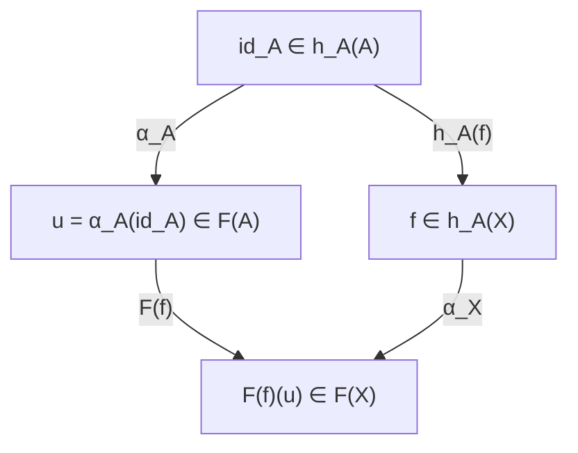

# Yoneda lemma

# 개요

범주론에서 대상의 정체는 그 안의 원소가 아니라 그 대상으로 들어오는 사상 전체로 결정된다.

Yoneda lemma 는 이 관점이 정당함을 보인다. $A$ 로 들어오는 사상들의 모임 $h_A$ 는 $A$ 에 대한 정보를 잃지 않고, 두 대상이 같은 방식으로 관찰되면 동형이다. [자연변환](natural-transformations.md)의 언어로 진술되고 증명은 몇 줄이다.

보편 성질로 정의한 대상의 유일성 증명, 표현가능 함자의 판정, 대수기하의 함자적 관점이 이 정리의 응용이다.

# 직관

## 관찰에 의한 결정

$\mathbf{Set}$ 에서 한 점 집합 $1$ 에서 $A$ 로 가는 사상은 $A$ 의 원소와 같다. 군의 범주에서 $\mathbb Z$ 로부터의 준동형은 원소 하나를 고르는 것과 같다.

일반화하면 $X$ 에서 $A$ 로 가는 사상이 $X$ 모양의 관찰이다. Yoneda lemma 는 모든 모양의 관찰을 모으면 $A$ 를 복원할 수 있다고 말한다.

## 항등사상의 역할

$h_A$ 에서 출발하는 자연변환은 성분이 많지만 $\alpha_A(\mathrm{id}\_A)$ 하나로 전부 결정된다. $h_A(X)$ 의 원소 $f:X\to A$ 는 $h_A(f)$ 를 $\mathrm{id}\_A$ 에 적용한 결과이고, 자연성이 $\alpha$ 와 $h_A(f)$ 의 교환을 요구하므로 $\alpha_X(f)$ 가 $F(f)(\alpha_A(\mathrm{id}\_A))$ 로 강제된다.

사각형의 가환성이 자연성이고, 왼쪽 위에서 오른쪽 아래로 가는 두 길이 같다는 것이 $\alpha_X(f)=F(f)(u)$ 다.

# 정의

## 표현가능 함자

$\mathcal C$ 를 locally small 범주, $A$ 를 $\mathcal C$ 의 대상이라 하자. $A$ 로 향하는 사상들이 반변 함자를 이룬다.

$$
h_A(X)=\mathrm{Hom}\_C(X,A)
$$

$f:X\to Y$ 에 대해 $h_A(f):h_A(Y)\to h_A(X)$ 는 앞합성 $g\mapsto g\circ f$ 다. 어떤 함자가 이런 꼴과 자연동형이면 **표현가능**하다고 하고 $A$ 를 그 표현 대상이라 한다.

## 정리

$F:C^{\mathrm{op}}\to\mathbf{Set}$ 에 대해

$$
\mathrm{Nat}(h_A,F)\cong F(A)
$$

인 전단사가 있으며 $A$ 와 $F$ 양쪽에 대해 자연스럽다. 대응은 자연변환 $\alpha$ 를 $\alpha_A(\mathrm{id}\_A)$ 로 보낸다.

# 성질

## 증명

$u\in F(A)$ 가 주어지면 $f:X\to A$ 에 대해 $\alpha_X(f)=F(f)(u)$ 로 자연변환을 정의한다. 함자가 합성을 보존하므로 성분들이 자연성을 만족한다. 거꾸로 $\alpha$ 가 주어지면 $u=\alpha_A(\mathrm{id}\_A)$ 로 두고 자연성 사각형을 $\mathrm{id}\_A$ 에 적용하면 모든 $f$ 에서 위 식이 강제된다. 두 구성이 서로 역이므로 전단사다.

증명에 쓰인 것은 함자성과 자연성뿐이고 구체적인 범주의 성질은 쓰지 않으므로 결론이 모든 범주에서 성립한다.

## Yoneda 매장

$F=h_B$ 로 두면 다음을 얻는다.

$$
\mathrm{Nat}(h_A,h_B)\cong\mathrm{Hom}\_C(A,B)
$$

따라서 $A\mapsto h_A$ 로 주어지는 함자 $C\to[C^{\mathrm{op}},\mathbf{Set}]$ 는 full 이고 faithful 하다. 이를 **Yoneda 매장**이라 하며, 임의의 범주를 함자 범주 안에 충실하게 넣을 수 있다.

따름정리로 $h_A\cong h_B$ 이면 $A\cong B$ 다. 각 $X$ 에서 집합 $h_A(X)$ 와 $h_B(X)$ 의 크기만 같은 것으로는 부족하고 모든 사상과 양립하는 자연동형이 있어야 한다.

## 보편 성질의 유일성

보편 성질로 정의된 대상은 대개 어떤 함자를 표현한다. 곱 $A\times B$ 는 $X\mapsto\mathrm{Hom}(X,A)\times\mathrm{Hom}(X,B)$ 를 표현하고, 자유군은 망각 함자의 왼쪽 수반으로 $X\mapsto\mathrm{Hom}\_{\mathbf{Set}}(S,U(X))$ 를 표현한다.

표현 대상이 동형을 무시하고 유일하다는 것은 Yoneda 매장의 충실성에서 나온다. 두 대상 사이에 사상을 만들고 합성이 항등임을 확인하는 절차를 되풀이하지 않아도 된다.

poset 범주에서 $h_A$ 는 $A$ 이하인 원소들의 집합이고, Yoneda 매장은 원소를 그 아래집합으로 보내는 사상이다. 순서를 아래집합의 포함으로 복원할 수 있다는 것이 이 범주에서의 Yoneda lemma 이고, 격자 이론의 Dedekind–MacNeille 완비화가 같은 구성이다.

## 공변판과 밀도

공변 함자 $F:C\to\mathbf{Set}$ 와 $h^A(X)=\mathrm{Hom}(A,X)$ 에 대해서도 같은 형태가 성립한다.

$$
\mathrm{Nat}(h^A,F)\cong F(A)
$$

화살표 방향만 뒤집으면 되므로 별개의 정리가 아니다. 모든 preSheaf 는 표현가능한 것들의 쌍대제한으로 쓸 수 있고, 이를 co-Yoneda lemma 또는 밀도 정리라 한다. 표현가능 함자가 함자 범주의 생성원 역할을 한다는 뜻이다.

# 활용

- **함자적 관점.** 대수기하에서 스킴을 각 환에 그 환 위의 점들을 대응시키는 함자로 다룬다. 모듈라이 공간은 분류 문제를 표현하는 대상으로 정의되고, 그 존재는 해당 함자의 표현가능성 문제가 된다. 표현가능하지 않을 때 스택으로 확장하는 것도 같은 틀 안에 있다.
- **계산의 축약.** 자연변환 전체 대신 한 대상의 한 원소만 보면 된다. 코호몰로지 연산의 분류, 자유 대상의 구성, [수반](adjunctions.md)의 존재 판정이 이 축약을 쓰고, 수반 함자 정리도 각 대상마다 어떤 함자가 표현가능한지를 묻는 형태로 서술된다.
- **프로그래밍.** 연속 전달 방식의 변환 $(\forall r.\ (a\to r)\to r)\cong a$ 가 Yoneda lemma 의 특수한 경우다. 자유 monad 구성, lens 의 여러 표현이 동등하다는 사실, 함자를 감싸 map 연산의 합성을 지연시키는 Yoneda 변환이 같은 정리의 적용이다.[^1]

[^1]: Emily Riehl, *Category Theory in Context*, §2.2. Yoneda lemma 와 Yoneda 매장의 full faithfulness. https://emilyriehl.github.io/files/context.pdf

# 연관 문서

## 선수지식

- [자연변환](natural-transformations.md)

## 더 알아보기

- [수반](adjunctions.md)

#category_theory #order_theory #algebra #theorem
