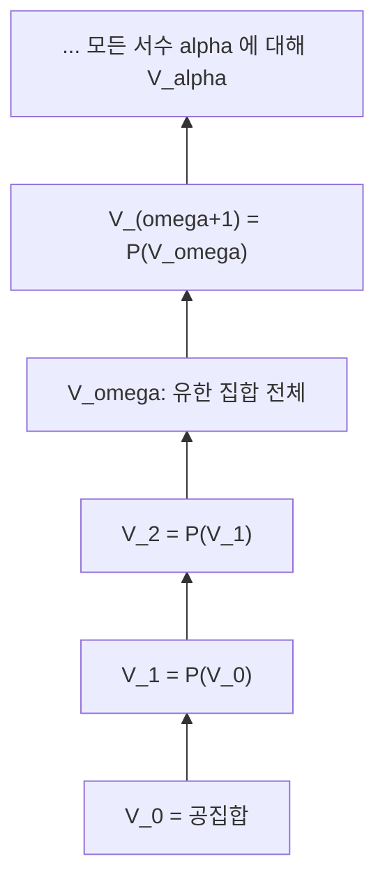

# ZFC 공리계

# 개요

ZFC는 Zermelo–Fraenkel 집합론에 선택공리를 더한 공리계로, 현대 수학의 표준적 기초로 쓰인다. 언어는 이항 관계 기호 하나(원소 관계)만 가진 [1차 논리](first-order-logic.md)이며, 모든 수학적 대상을 집합 하나로 부호화한다.

핵심 설계 원리는 "무엇이 집합인지 위에서 규정하지 않고, 이미 있는 집합에서 새 집합을 만드는 연산만 허용한다"는 것이다. 이 제한이 "모든 집합의 집합"류의 대상을 배제해 Russell 역설을 피한다.

ZFC로부터 자연수, 정수, 유리수, 실수, 함수, 관계, 군·환·체 등이 전부 구성된다. 반면 연속체 가설처럼 ZFC로 판정할 수 없는 문장도 존재한다.

# 직관

[집합](sets.md)의 소박한 이해에서는 "성질 P를 만족하는 모든 것의 모임"을 집합으로 인정한다. 여기서 P를 "자기 자신을 원소로 갖지 않는다"로 두면 다음 모순이 나온다.

$$
R=\{\,x : x\notin x\,\}\ \Longrightarrow\ R\in R \iff R\notin R
$$

ZFC의 해법은 무제한 내포를 버리고, 이미 주어진 집합 A의 부분집합만 성질로 잘라내도록 허용하는 것이다(분류 공리). 그러면 위 논법은 모순 대신 "R은 어떤 집합에도 속하지 않는다", 즉 모든 집합의 집합은 없다는 결론만 준다.

집합 세계의 모습은 공집합에서 시작해 거듭제곱집합을 반복하며 층층이 쌓아 올린 누적 위계로 그려진다.



정칙성 공리는 이 그림이 아래로 무한히 내려가지 않음을, 즉 모든 집합이 유한 번 만에 공집합에 도달함을 보장한다.

# 정의

아래에서 변수는 모두 집합을 가리키고, 원소 관계만 원시 기호다. 부분집합 관계는 축약 표기로 정의한다.

$$
A\subseteq B \ :\iff\ \forall x\,(x\in A\to x\in B)
$$

## 공리 목록

1. 외연성(extensionality): 원소가 같은 집합은 같다.

$$
\forall A\,\forall B\,\bigl(\forall x\,(x\in A\leftrightarrow x\in B)\to A=B\bigr)
$$

2. 짝(pairing): 임의의 a, b에 대해 둘만을 원소로 갖는 집합이 있다.

$$
\forall a\,\forall b\,\exists P\,\forall x\,\bigl(x\in P\leftrightarrow (x=a\vee x=b)\bigr)
$$

3. 합집합(union): 집합족의 원소들을 모은 집합이 있다.

$$
\forall F\,\exists U\,\forall x\,\bigl(x\in U\leftrightarrow \exists A\,(A\in F\wedge x\in A)\bigr)
$$

4. 거듭제곱집합(power set): 부분집합 전체의 집합이 있다.

$$
\forall A\,\exists P\,\forall B\,(B\in P\leftrightarrow B\subseteq A)
$$

5. 분류 스킴(separation): 각 논리식 phi마다 하나의 공리. A의 원소 중 phi를 만족하는 것들이 집합을 이룬다.

$$
\forall A\,\exists S\,\forall x\,\bigl(x\in S\leftrightarrow (x\in A\wedge \varphi(x,\vec p))\bigr)
$$

6. 치환 스킴(replacement): 각 논리식 phi마다 하나의 공리. phi가 A 위에서 함수처럼 행동하면 그 상이 집합을 이룬다.

$$
\forall x\in A\,\exists! y\,\varphi(x,y)\ \Longrightarrow\ \exists B\,\forall y\,\bigl(y\in B\leftrightarrow\exists x\in A\,\varphi(x,y)\bigr)
$$

7. 무한(infinity): 공집합을 포함하고 후속자에 닫힌 집합이 있다. 후속자는 다음으로 정의한다.

$$
S(x)=x\cup\{x\},\qquad \exists I\,\bigl(\varnothing\in I\wedge \forall x\,(x\in I\to S(x)\in I)\bigr)
$$

8. 정칙성(regularity, foundation): 공집합이 아닌 집합은 원소 관계에 대해 극소인 원소를 갖는다.

$$
\forall A\,\bigl(A\neq\varnothing \to \exists m\in A\ (m\cap A=\varnothing)\bigr)
$$

9. 선택(choice): 공집합을 원소로 갖지 않는 집합족에는 선택함수가 있다([선택공리와 Zorn 보조정리](axiom-of-choice.md)).

$$
\forall F\,\bigl(\varnothing\notin F \to \exists f:F\to\bigcup F\ \ \forall A\in F\ f(A)\in A\bigr)
$$

공집합의 존재는 무한 공리와 분류로부터 나오므로 별도 공리로 두지 않아도 된다. 1에서 8까지를 ZF, 9를 더한 것을 ZFC, 9를 뺀 체계를 ZF라 부른다[^1].

# 성질

## Russell 역설의 회피

분류는 "A의 부분집합"만 만든다. 모든 집합의 집합 V가 있다고 가정하면 분류로 위의 R을 얻어 모순이 된다. 따라서 ZF에서는 그런 V가 없다. 정칙성은 더 강하게 x가 x의 원소인 집합 자체를 배제한다. x가 x에 속하면 하나짜리 집합에 정칙성을 적용해 모순이 나온다.

## 분류와 치환

분류는 치환에서 따라 나온다. phi를 만족하는 x를 x 자신으로 보내는 부분함수에 치환을 적용하면 된다. 역방향은 성립하지 않는다. 분류는 결과 집합의 크기를 A로 제한하지만, 치환은 A의 크기를 넘지 않는 새 집합을 A 밖에서 만들어 낸다. 예컨대 자연수 n마다 n번째 거듭제곱집합을 대응시키는 함수의 상은 분류만으로는 얻을 수 없다. Zermelo의 원래 체계에 치환을 추가한 것이 Fraenkel과 Skolem의 기여이며, 이것 없이는 [서수](ordinals.md)의 표준적 구성과 초한 재귀가 작동하지 않는다.

## 폰 노이만 자연수

무한 공리가 주는 I에서 분류로 "후속자 닫힌 모든 집합에 속하는 원소"만 남기면 최소의 귀납적 집합을 얻는다. 이를 자연수 집합으로 정의한다[^2].

$$
0=\varnothing,\quad 1=\{0\},\quad 2=\{0,1\},\quad n+1=n\cup\{n\},\qquad \omega=\bigcap\{\,I : I \text{ 귀납적}\,\}
$$

이 정의에서 n의 원소 개수는 정확히 n이고, m이 n의 원소인 것과 m이 n보다 작은 것이 같다. 즉 순서 관계가 원소 관계로 무료로 얻어진다. 외연성과 정칙성 덕분에 각 자연수는 유일하게 결정되고, 수학적 귀납법은 최소성에서 바로 나온다. 정수·유리수는 [동치류](relations.md)로, 실수는 유리수 Cauchy 수열의 동치류나 Dedekind 절단으로 구성한다.

## 순서쌍과 함수

$$
(a,b)=\bigl\{\{a\},\{a,b\}\bigr\}
$$

짝 공리를 두 번 쓰면 존재하고, 외연성으로 첫 성분과 둘째 성분이 복원된다. 곱집합은 거듭제곱집합과 분류로 만들고, [함수](functions.md)는 곱집합의 특별한 부분집합으로 정의한다. 관계, 순서, 대수 구조가 모두 이 위에 올라간다.

## 한계

- 일관성: ZFC가 무모순이면 그 사실을 ZFC 안에서 증명할 수 없다([Gödel 불완전성 정리](godel-incompleteness.md)).
- 독립성: 연속체 가설과 선택공리는 ZF에서 독립이다. Gödel의 구성 가능 집합 모형과 Cohen의 forcing이 양쪽 방향을 준다.
- 모델의 존재: ZFC가 무모순이면 Löwenheim–Skolem에 의해 가산 모델이 있다. 모델 내부의 "비가산"은 그 모델이 가진 전단사만 보고 판정되기 때문에 모순이 아니다([가산성과 비가산성](cardinality.md)).

# 활용

## 클래스와 표기

"모든 집합의 모임"이나 "모든 서수의 모임"은 집합이 아니므로, 논리식을 줄여 쓴 약칭으로만 쓴다. 이를 proper class라 부른다. [범주](category.md)론에서 "모든 집합의 범주"를 다룰 때 이 구분이 문제가 되며, Grothendieck universe를 추가하거나 NBG 같은 클래스 이론으로 옮기는 우회로를 쓴다.

## 큰 기수와 확장

ZFC로 판정되지 않는 문장을 다루기 위해 도달 불가능 기수, 측정 가능 기수 등 큰 기수 공리를 추가하는 확장을 연구한다. 이들은 증명 강도를 단계적으로 올리며, 각 단계는 앞 단계의 무모순성을 함의한다.

## 형식화 예

증명 보조기에서 ZFC 스타일 공리를 그대로 선언해 쓸 수 있다.

```text
axiom extensionality:  forall A B. (forall x. x in A <-> x in B) -> A = B
axiom power:           forall A. exists P. forall B. B in P <-> B subset A
scheme separation(phi): forall A. exists S. forall x. x in S <-> (x in A and phi(x))

def   0        := emptyset
def   succ(x)  := x union {x}
def   omega    := least inductive set
```

실제 수학 대부분은 거듭제곱집합을 몇 번만 쓰는 낮은 층에서 진행되므로, ZFC의 강한 공리 전부를 필요로 하지 않는다. 어떤 정리가 어느 공리를 정말 필요로 하는지 재는 작업이 reverse mathematics다.

[^1]: Zermelo-Fraenkel Axioms, Wolfram MathWorld. https://mathworld.wolfram.com/Zermelo-FraenkelAxioms.html
[^2]: Set-theoretic definition of natural numbers (von Neumann ordinals). https://en.wikipedia.org/wiki/Set-theoretic_definition_of_natural_numbers

# 연관 문서

## 선수지식

- [집합](sets.md)
- [1차 논리](first-order-logic.md)

## 더 알아보기

- [선택공리와 Zorn 보조정리](axiom-of-choice.md)
- [서수와 초한귀납법](ordinals.md)
- [연속체 가설과 독립성](continuum-hypothesis.md)

#set_theory #foundations
