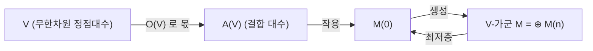

# Zhu 대수와 모듈러 불변성

# 개요

[정점작용소대수](vertex-operator-algebras.md) $V$ 의 가군 $M$ 에 지표를 붙인다.

$$
\operatorname{ch}_M(\tau)=\operatorname{tr}_Mq^{L_0-c/24},\qquad q=e^{2\pi i\tau}
$$

등급 차원의 생성함수일 뿐이고, 정의만 보면 $q$ 의 형식급수 이상도 이하도 아니다. 그런데 알려진 예마다 이것이 모듈러 성질을 가졌다. 격자 VOA 에서 theta 급수를 $\eta$ 로 나눈 꼴이 나오고, Virasoro 최소모형에서 Rocha-Caridi 공식이 나오고, [괴물 달빛](monstrous-moonshine.md)에서는 $j-744$ 가 나온다.

우연이 반복되면 정리다. **Zhu 가 1996 년에 그것이 정리임을 증명했다.**

> $V$ 가 $C_2$ 여유한이고 유리적이면, 기약가군은 유한개이고 지표들이 상반평면에서 수렴하며, 그 유한차원 span 위에서 $\mathrm{SL}_2(\mathbb Z)$ 가 작용한다.

$$
\operatorname{ch}_{M_i}\negthinspace\left(\frac{a\tau+b}{c\tau+d}\right)=\sum_j\rho(\gamma)_{ij}\operatorname{ch}_{M_j}(\tau)
$$

대수적 대상에서 나온 급수가 모듈러 형식이 되는 이유를 대수 쪽 조건으로 설명한 것이고, 달빛 현상 전체의 기반이 된다.

증명의 도구가 **Zhu 대수** $A(V)$ 다. 무한차원인 $V$ 에서 결합 대수 하나를 뽑아내는 구성인데, 그 대수의 기약가군이 $V$ 의 기약가군과 일대일 대응한다. 무한차원 정점대수의 표현론이 유한차원 결합대수의 표현론으로 내려온다. 가군을 분류하는 일과 지표의 모듈러성을 증명하는 일이 이 한 구성에서 갈라져 나온다.

# 직관

## 지표가 모듈러라는 것이 왜 자명하지 않은가

물리 쪽 그림에서 $\operatorname{ch}_M(\tau)$ 는 복소 원환면 $\mathbb C/(\mathbb Z+\mathbb Z\tau)$ 위의 분배함수다. 원환면은 $\tau$ 와 $-1/\tau$ 를 같은 모양으로 보므로, 분배함수가 $\tau$ 의 모듈러 성질을 가져야 "자연스럽다".

$$
\tau\ \longmapsto\ -\frac1\tau\quad:\quad\text{원환면의 두 주기를 맞바꾸기}
$$

문제는 대각합을 실제로 계산할 때 한 방향을 시간, 다른 방향을 공간으로 **고른다**는 데 있다. 지표의 정의에 들어간 $L_0$ 가 한 방향만 본다. 두 방향을 맞바꾸면 같은 대상을 다르게 계산한 것이라 값이 같아야 할 것 같지만, 그 논증은 계산이 수렴하고 대각합이 잘 정의될 때만 성립한다. 무한차원 공간에서 이것은 공짜가 아니다.

실제로 가정을 빼면 정리가 무너진다. $\mathfrak{sl}_2$ 아핀 VOA 를 음의 정수가 아닌 레벨에서 보거나 $C_2$ 여유한이 아닌 VOA 를 보면 지표가 수렴하지 않거나, 수렴해도 모듈러 궤도가 무한차원이 된다. 그래서 필요한 것은 **유한성** 조건이다.

## $C_2$ 여유한이 공급하는 유한성

$C_2(V)=\operatorname{span}\lbrace a_{-2}b:a,b\in V\rbrace$ 로 두고 $\dim V/C_2(V)<\infty$ 를 요구하는 것이 $C_2$ 여유한 조건이다. 첫인상은 기술적이지만 결과가 강력하다.

이 조건이 있으면 지표가 만족하는 **미분방정식**이 나온다. $V/C_2(V)$ 가 유한차원이라 그 위의 어떤 연산이 유한 단계에서 선형종속을 만들고, 그것이 모듈러 형식 계수를 갖는 선형상미분방정식으로 번역된다.

$$
\left(\partial_q^{(n)}+g_2(\tau)\partial_q^{(n-2)}+\cdots+g_n(\tau)\right)f=0,\qquad g_k\in M_{2k}(\mathrm{SL}_2(\mathbb Z))
$$

계수가 모듈러 형식이므로 방정식 자체가 $\mathrm{SL}_2(\mathbb Z)$ 에 불변이다. 그러면 해공간(유한차원)이 $\mathrm{SL}_2(\mathbb Z)$ 표현이 되고, 지표들이 그 해공간에 들어 있으므로 모듈러 변환 아래에서 서로 섞인다. **불변인 방정식의 해공간은 불변이다** 는 한 줄이 증명의 골격이다.

수렴성도 여기서 나온다. 정칙특이점만 갖는 방정식의 해는 첨점 근처에서 다항 증가라 급수가 실제로 수렴한다.

## Zhu 대수가 잡아내는 것

허용가군은 아래로 유계인 등급 공간이다.

$$
M=\bigoplus_{n\ge0}M(n),\qquad L_0|_{M(n)}=h+n
$$

$M$ 이 기약이면 최저층 $M(0)$ 이 전체를 생성하므로, $M$ 을 아는 것과 $M(0)$ 을 아는 것이 사실상 같다. 그렇다면 $M(0)$ 에는 무엇이 작용하는가.

$a\in V$ 의 성분 중 등급을 보존하는 것 $o(a)=a_{\mathrm{wt}\thinspace a-1}$ 만 $M(0)$ 을 $M(0)$ 으로 보낸다. 이 작용소들이 만드는 대수가 $A(V)$ 이고, $V$ 에서 "등급을 바꾸는 부분" 을 몫으로 날려 얻는다.

오른쪽 위로 올라가는 화살표가 있다는 것, 곧 $A(V)$ 가군에서 $V$ 가군을 복원할 수 있다는 것이 정리의 내용이다. 정점대수의 복잡한 공리가 결합대수 하나로 압축되고, 그 대수가 유한차원인 경우가 실제로 잘 다루어지는 경우다.

# 정의

## Zhu 대수

$V=\bigoplus_nV_n$ 을 등급 VOA 라 하고 동차원소 $a\in V_{\mathrm{wt}\thinspace a}$ 에 대해 두 연산을 정의한다.

$$
a*b=\operatorname*{Res}_z\left(Y(a,z)b\thinspace\frac{(1+z)^{\mathrm{wt}\thinspace a}}{z}\right),\qquad
a\circ b=\operatorname*{Res}_z\left(Y(a,z)b\thinspace\frac{(1+z)^{\mathrm{wt}\thinspace a}}{z^2}\right)
$$

$O(V)=\operatorname{span}\lbrace a\circ b\rbrace$ 로 두고

$$
A(V)=V/O(V)
$$

를 **Zhu 대수**라 한다. $*$ 가 $O(V)$ 를 내리고 몫에서 결합적이 되며, $[\mathbf1]$ 이 단위원, $[\omega]$ 가 중심에 들어간다. 두 식의 차이는 $z$ 의 거듭제곱 하나뿐인데 하나는 곱을 정의하고 하나는 날릴 것을 정의한다.

## 유한성 조건

- **$C_2$ 여유한**: $C_2(V)=\operatorname{span}\lbrace a_{-2}b\rbrace$ 에 대해 $\dim V/C_2(V)<\infty$ 인 것.
- **유리적**: 모든 허용가군이 완전가약.

두 조건은 논리적으로 독립하지만 알려진 예에서는 대개 함께 성립하고, 둘 다 만족하는 VOA 를 **강유리적**이라 부른다. $C_2$ 여유한이면 $A(V)$ 가 유한차원이고 기약가군이 유한개다.

## 두 정리

> **분류 정리 (Zhu).** $M\mapsto M(0)$ 이 $V$ 의 기약 허용가군의 동형류와 $A(V)$ 의 기약가군의 동형류 사이의 전단사를 준다.

> **모듈러 불변성 정리 (Zhu).** $V$ 가 $C_2$ 여유한, 유리적이고 $V_0=\mathbb C\mathbf1$ 이면 기약가군 $M_1,\dots,M_k$ 의 지표가 $\mathbb H$ 에서 수렴하고, 그 span 위에 $\mathrm{SL}_2(\mathbb Z)$ 의 $k$ 차원 표현 $\rho$ 가 있어 위 변환식이 성립한다.

# 성질

## 예시

| $V$ | $A(V)$ | 기약가군 |
|---|---|---|
| 일반 $c$ 의 Virasoro $L(c,0)$ | $\mathbb C[x]$ | $x$ 의 값 $h$ 마다 하나, 무한개 |
| Virasoro 최소모형 $L(c_{p,q},0)$ | 유한차원 몫 $\mathbb C[x]/f(x)$ | $(p-1)(q-1)/2$ 개 |
| 격자 VOA $V_L$ ($L$ 짝수) | $\mathbb C[L^*/L]$ | $\vert L^*/L\vert$ 개, 잉여류로 색인 |
| $V^\natural$ | $\mathbb C$ | 자기 자신 하나뿐 |

$A(V)=\mathbb C[x]$ 인 경우 $x=[\omega]$ 이고 그 고유값이 최고무게 $h$ 다. 최소모형에서는 $f(x)$ 의 근이 Kac 표의 $h_{r,s}$ 값들이라 가군 개수가 유한해진다. 기약가군 분류가 다항식 하나의 근을 찾는 문제로 내려온다.

마지막 줄이 괴물 달빛의 출발점이다. $V^\natural$ 은 $A(V)=\mathbb C$ 라 기약가군이 자기 자신뿐이고(**홀로모픽**), 그러면 지표가 1 차원 표현이라 $\mathrm{SL}_2(\mathbb Z)$ 에 대해 상수배로만 변한다. 무게 0 이고 첨점에서 극이 하나인 그런 함수는 $j$ 의 상수 이동밖에 없다.

## 무엇이 증명의 어려운 부분인가

수치 확인은 쉽지만 일반 증명은 그렇지 않다. 핵심 단계를 순서대로 보면 각각 다른 어려움이 있다.

1. **원환면 위 1 점 함수 공간의 정의.** $\operatorname{tr}_Mo(a)q^{L_0-c/24}$ 꼴을 $a\in V$ 에 대해 모은 공간을 놓고, 그것이 만족하는 재귀식(Zhu 재귀)을 세운다. Weierstrass $\wp$ 함수와 Eisenstein 급수가 여기서 계수로 들어온다.
2. **유한차원성.** $C_2$ 여유한 조건으로 이 공간이 유한차원임을 보인다. 가장 기술적인 부분이고, $V/C_2(V)$ 의 유한 생성원으로 재귀를 끝내는 논증이다.
3. **$\mathrm{SL}_2(\mathbb Z)$ 작용.** 1 점 함수 공간이 격자 $\mathbb Z+\mathbb Z\tau$ 의 기저 교체에 대해 불변이므로 작용이 생긴다.
4. **지표가 기저.** 유리성으로 기약가군의 지표들이 이 공간을 채운다.

$C_2$ 여유한 가정을 빼면 2 가 무너진다. 대수적으로 자연스러운 VOA 중 이 조건을 만족하지 않는 것이 많아(아핀 VOA 의 승인가능하지 않은 레벨, 로그 등각장론) 확장이 활발히 연구된다. 이 경우 지표만으로는 모듈러 표현이 닫히지 않고 $\tau$ 의 로그를 포함한 유사지표를 함께 넣어야 한다. Miyamoto 와 Huang 의 후속 작업이 $C_2$ 여유한이되 유리적이 아닌 경우로 정리를 넓혔다.[^1]

# 활용

## 왜 $j$ 인가

괴물 달빛에서 가장 먼저 설명되어야 할 것은 "왜 하필 $j$ 인가" 였다. Zhu 정리가 답을 준다. $V^\natural$ 이 홀로모픽이므로 지표가 $\mathrm{SL}_2(\mathbb Z)$ 아래 불변인 무게 0 함수이고, 등급이 $-1$ 에서 시작하므로 첨점에서 단순극을 가지며, $V^\natural_1=0$ 이라 상수항이 0 이다. 이 세 조건을 만족하는 함수가 $j-744$ 하나뿐이다.

$$
\operatorname{ch}_{V^\natural}(\tau)=J(\tau)=j(\tau)-744=q^{-1}+196884q+\cdots
$$

곧 홀로모픽 $c=24$ VOA 이면 $j$ 가 반드시 나온다. 남은 내용은 그 VOA 위에 괴물군이 작용한다는 쪽으로 옮겨간다.

## 모듈러 텐서범주와 Verlinde 공식

기약가군들이 융합곱으로 텐서범주를 이루고, 지표의 $S$ 행렬이 그 범주의 $S$ 행렬과 일치한다. Verlinde 공식은 융합 구조상수를 $S$ 행렬로 준다.

$$
N_{ij}^k=\sum_m\frac{S_{im}S_{jm}\overline{S_{km}}}{S_{0m}}
$$

대수의 표현론(왼쪽)이 해석적 변환 행렬(오른쪽)로 계산된다는 이 등식이 Zhu 정리가 없으면 진술조차 불가능하다. Huang 이 강유리 VOA 에 대해 증명했고, 3 차원 위상적 장론과 매듭 불변량으로 이어진다.

## 등각장론의 분류

$c$ 를 고정하고 홀로모픽 VOA 를 분류하는 문제가 격자 분류의 VOA 판본이다. $c=8$ 에서 $V_{E_8}$ 하나, $c=16$ 에서 둘, $c=24$ 에서 71 개(Schellekens 목록)로 [Niemeier 격자](niemeier-lattices.md)의 24 개와 평행하게 커진다. 지표가 모듈러라는 사실이 분류의 출발점이 되는데, 무게 0 모듈러 함수의 공간이 유한차원이라 가능한 지표가 유한개로 제한되고 그것이 후보 목록을 만들기 때문이다.

[^1]: 원논문은 Y. Zhu, *Modular invariance of characters of vertex operator algebras*, J. Amer. Math. Soc. 9 (1996). $C_2$ 여유한이되 유리적이 아닌 경우로의 확장은 M. Miyamoto, *Modular invariance of vertex operator algebras satisfying $C_2$ cofiniteness*, Duke Math. J. 122 (2004). Verlinde 공식의 증명은 Y.-Z. Huang, *Vertex operator algebras and the Verlinde conjecture*, Commun. Contemp. Math. 10 (2008). 교과서적 정리는 C. Dong–J. Lepowsky 와 A. Matsuo–K. Nagatomo 의 강의록. 본문의 수치 확인은 직접 한 것이다.

# 연관 문서

## 선수지식

- [정점작용소대수](vertex-operator-algebras.md)

## 더 알아보기

- [모듈러 텐서범주와 3 차원 TQFT](modular-tensor-categories.md)
- [Schellekens 목록과 홀로모픽 c=24 VOA 분류](schellekens-list.md)

#algebra #complex_analysis #theorem
